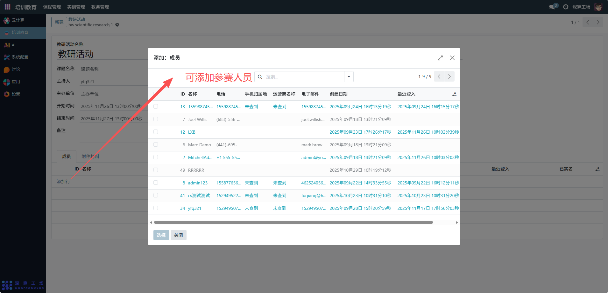
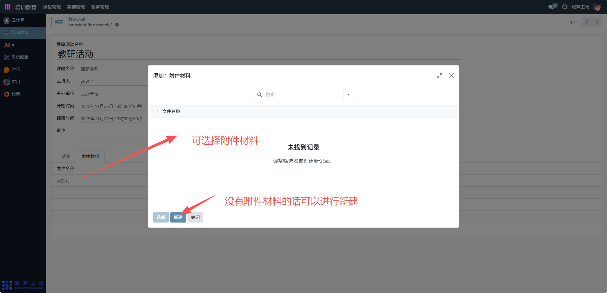

# 教研活动
“教研活动” 是教学研究活动的全流程管理工具，核心作用是统筹教研活动的基本信息、参与人员与配套材料，实现教研活动从规划、组织到记录的规范化管理，是保障教研工作有序开展的核心模块。
## 1、活动基础信息配置
- 教研活动名称：填写活动的标识（如 “2025 秋季数据分析教学方法研讨会”）。
- 课题名称：关联活动对应的教研课题。
- 主持人 / 主办单位：明确活动的组织角色。
- 开始 / 结束时间：设置活动的具体时段。

## 2、参与人员与材料配置
成员（表格）：点击 “添加行”，填写参与人员的名称、电话、邮箱等信息，明确活动参与方。

附件材料：切换到该标签，上传活动相关的文档（如议程、课件），完成材料归档。

## 3、日常管理与运维
- 创建活动信息：填写基础信息，搭建教研活动的框架。
- 组织参与人员：添加成员信息，确定活动的参与范围。
- 归档活动材料：上传附件，集中管理活动相关文档。
- 跟踪活动状态：通过创建 / 更新时间，留存活动的管理记录。