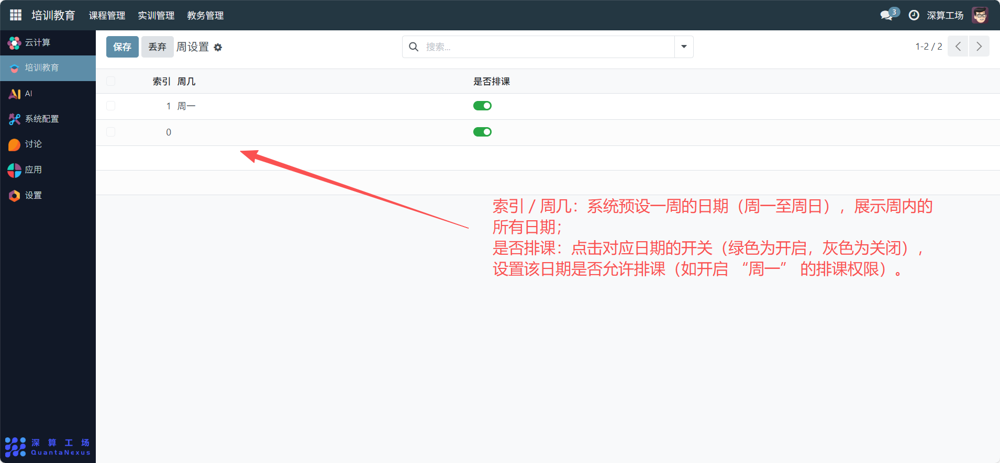

# 周设置
“周设置” 是排课规则的基础配置工具，核心作用是定义一周内哪些日期允许排课，统一排课的时间范围，避免在非教学日（如周末）安排课程，是保障排课合理性的前置规则模块。
## 1、周日期与排课权限配置
- 索引 / 周几：系统预设一周的日期（周一至周日），展示周内的所有日期。
- 是否排课：点击对应日期的开关（绿色为开启，灰色为关闭），设置该日期是否允许排课（如开启 “周一” 的排课权限）。

## 2、日常管理与运维
- 配置排课日期：根据教学安排（如工作日排课、周末不排课），开启对应日期的 “是否排课” 开关。
- 同步排课规则：完成周设置后，后续 “开课计划” 等排课模块会自动应用该规则，仅在允许排课的日期安排课程。
- 调整排课规则：若教学时间调整（如周末加课），修改对应日期的开关状态，更新排课权限。