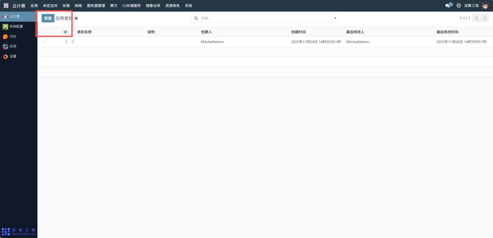
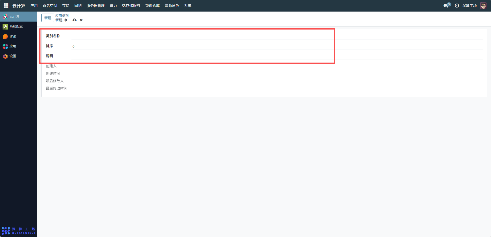
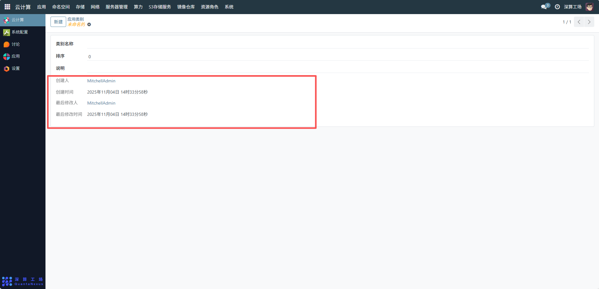

# 模板类别
应用类别是用于对平台内的应用进行分类管理的标签体系，核心作用是将应用按业务场景、功能类型等维度分组（比如 “开发工具类”“AI 训练类”“办公应用类”），方便用户快速筛选、查找目标应用，同时提升应用管理的条理性。
## 1、新增模板类别
新建：点击可创建新的应用类别。在前台应用中心的应用类别中显示

## 2、配置应用类别信息
- 1、类别名称：输入自定义的应用类别标识，用于区分不同应用分类。
- 2、排序：设置类别在列表中的展示顺序（如示例中的0，数值越小排序越靠前）。
- 3、说明：选填类别说明，描述该应用类别的用途、范围等补充信息。

## 3、查看管理信息
- 1、创建人：自动记录该类别创建账号。
- 2、创建时间：系统自动生成类别创建时间戳。
- 3、最后修改人：记录最后一次修改该类别的账号。
- 4、最后修改时间：系统自动生成最后修改时间戳。

