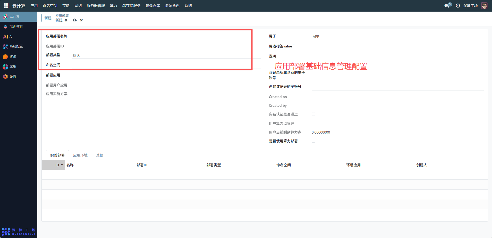
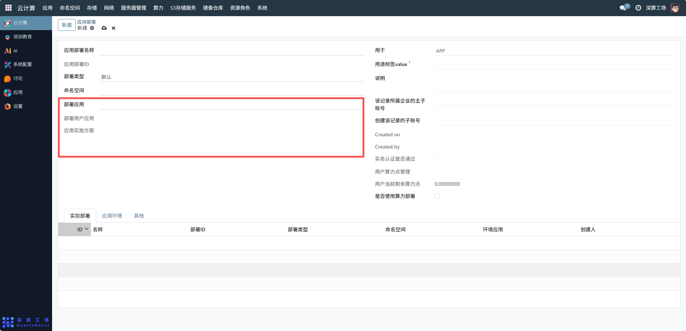
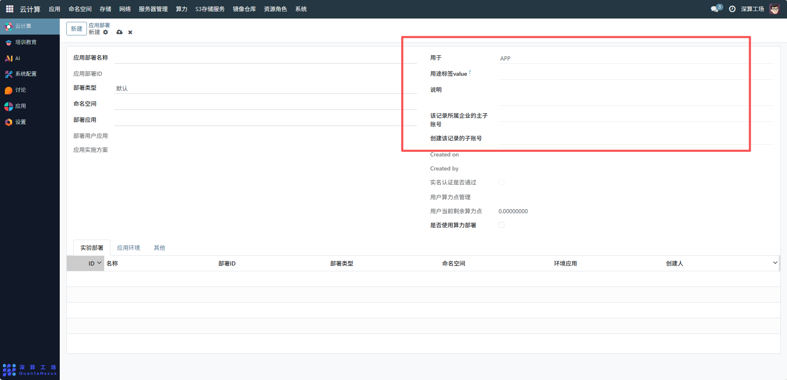
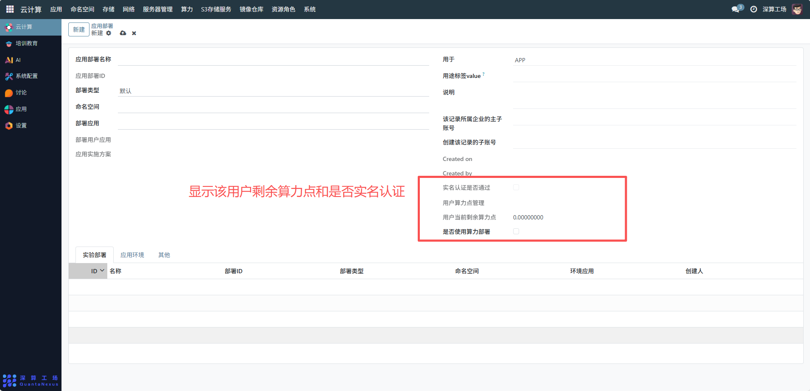
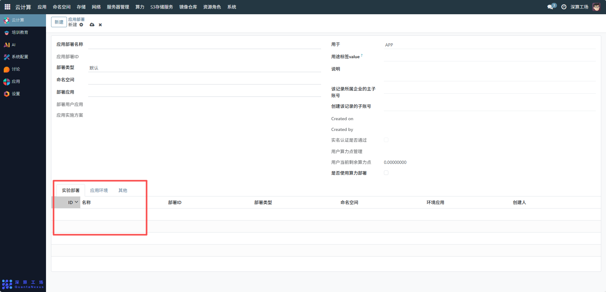
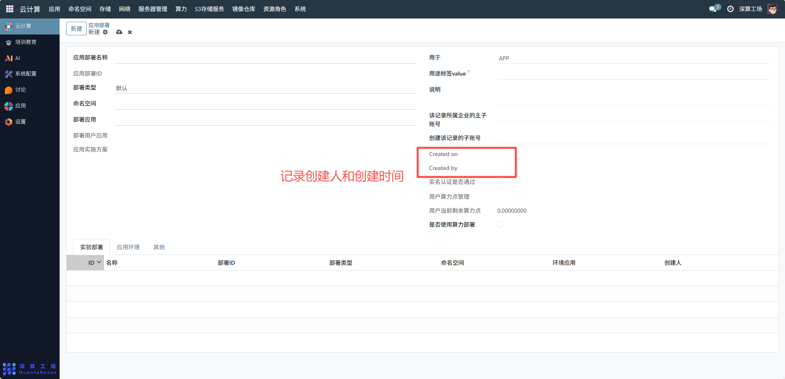

# 应用部署
应用部署主要用于将应用程序（或实验环境）配置并发布到云计算集群中，实现应用的容器化 / 虚拟化运行、资源分配与生命周期管理，是连接应用与集群资源的核心环节，支撑业务的上线、运行与维护，应用部署显示当前系统中所有已部署的应用，对部属的应用进行搜索、排序、分页浏览，并可对单条记录进行详情查看、编辑、删除等操作。
## 1、基础信息配置
- 应用部署名称：可查看编辑部署应用的标识名称便于区分不同应用的部署实例。
- 应用部署 ID：系统自动生成唯一 ID（或手动填写），用于部署实例的唯一标识。
- 部署类型：查看部署类型，匹配不同场景的资源调度策略。
- 命名空间：选择部署所属的 Kubernetes 命名空间，实现应用的隔离管理（需提前在 “命名空间” 模块创建）。

## 2、关联应用与方案
- 部署应用：若为公共模板应用，显示对应的应用配置。
- 部署用户应用：若为用户自定义应用，显示对应的用户应用配置。
- 应用实施方案：选择应用的部署方案（如资源规格、镜像版本等，需提前配置），确保部署参数的一致性。

## 3、用途与权限配置
- 用于 / 用途标签 value：填写部署的用途（如 “APP”）及对应的标签值，便于分类管理与资源统计。
- 企业 / 子账号信息：填写所属企业主子账号、创建记录的子账号，用于权限与资源归属的划分。

## 4、算力与合规配置
- 实名认证是否通过：勾选表示该部署对应的用户已完成实名认证（合规要求）。
用户算力点管理：
- 查看 “用户当前剩余算力点”，确认是否有足够算力支撑部署；
- 勾选 “是否使用算力部署”，启用算力点计费模式（若集群开启了算力计量）。

## 5、关联实验部署和应用环境
切换 “实验部署 / 应用环境 / 其他” 标签页，点击 “添加行” 关联已有的部署实例信息（如部署 ID、部署类型、命名空间等），实现应用与具体运行实例的绑定。

## 6、追溯与记录
界面中的 “Created on/Created by” 会自动记录部署的创建时间与创建人，用于操作审计与权限追溯。

