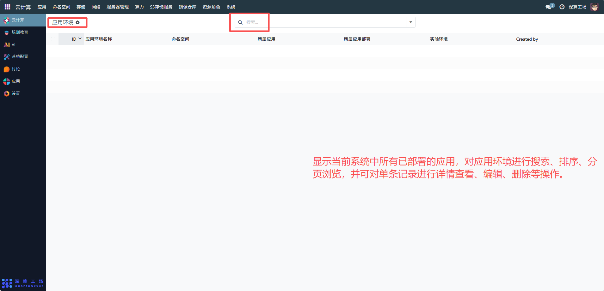

# 应用环境
应用环境主要用于管理应用运行所需的配置集合（如镜像版本、资源规格、依赖组件等），确保同一应用在不同场景下能快速复用一致的运行环境，提升应用部署的标准化与效率应用环境显示当前系统中所有已部署的应用，对应用环境进行搜索、排序、分页浏览，并可对单条记录进行详情查看、编辑、删除等操作。
## 1、核心信息配置
- 应用环境名称：可查看环境的标识名称（如 “AI 训练 - 生产环境 v2”），区分不同的环境版本。
- 命名空间：可查看环境所属的 Kubernetes 命名空间，实现环境的资源隔离（需提前在 “命名空间” 模块创建）。
- 所属应用：可查看关联对应的目标应用（需提前在 “应用” 模块创建），明确该环境是为哪个应用服务的。
- 所属应用部署：关联对应的应用部署实例（需提前在 “应用部署” 模块创建），将环境与具体的部署绑定。
- 实验环境：若该环境用于实验场景，关联对应的实验环境配置（需提前在 “实验环境” 模块创建）。
- 查询与筛选：通过顶部搜索框，按 “应用环境名称”“命名空间” 等关键词搜索目标环境，快速定位。
- 追溯记录：通过 “Created by” 字段，查看环境的创建人，用于权限与操作审计。

