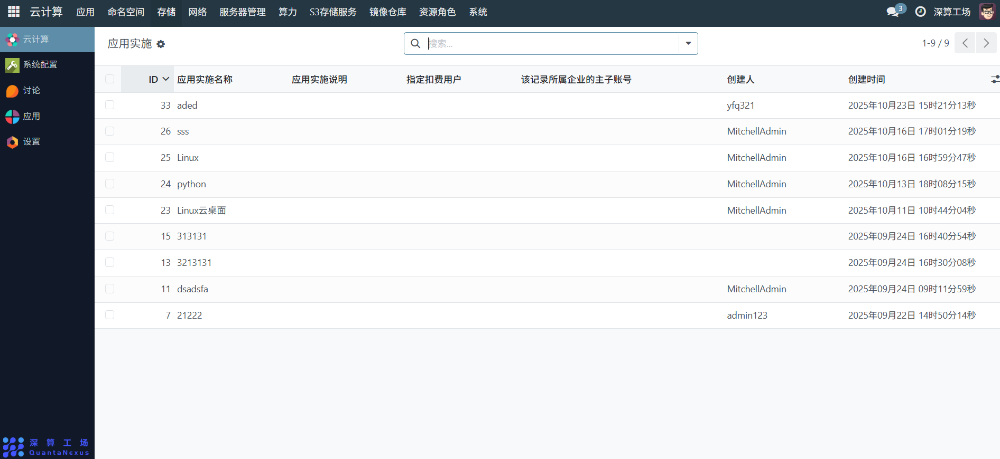
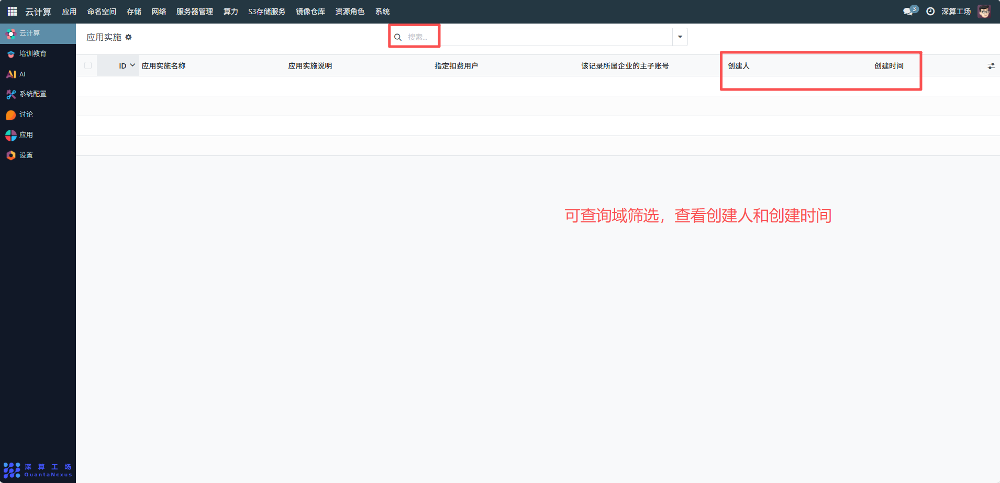

# 应用实施
应用实施主要用于管理应用从 “配置” 到 “落地运行” 的全流程执行方案，是应用部署的 “执行计划载体”，通过关联应用、用户、企业账号等信息，明确应用部署的责任主体、资源归属和计费对象，保障应用上线流程的规范化与可追溯性。管理员可在“应用实施”模块中查看所有已创建的应用实施记录，支持搜索、排序、分页浏览，并可对单条记录进行详情查看、编辑、删除等操作。
## 1、基础信息配置）
- 应用实施名称：输入实施计划的标识名称，区分不同应用的实施任务。
- 应用实施说明：填写实施的具体内容，明确实施的业务目标。
- 指定扣费用户：选择该实施计划对应的计费用户，用于算力 / 资源的费用扣减。
- 所属企业主子账号：关联对应的企业账号，明确实施计划的资源归属主体（适用于多租户场景）。

## 2、日常管理操作
查询与筛选：通过顶部搜索框，按 “应用实施名称”“创建人” 等关键词搜索目标实施计划，快速定位。
创建与删除：点击页面的 “新建” 按钮（通常在页面顶部）创建新的实施计划；选中已完成 / 废弃的实施计划后点击 “删除” 按钮，清理无效记录（注意：需确保实施计划未关联正在运行的应用部署）。
追溯记录：通过 “创建人”“创建时间” 字段，查看实施计划的创建主体与时间，用于操作审计和责任追溯。

