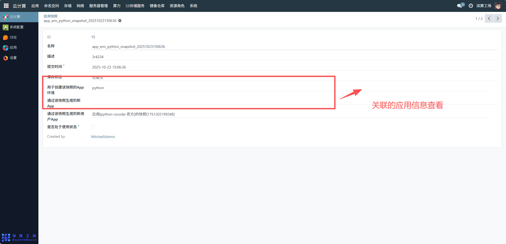
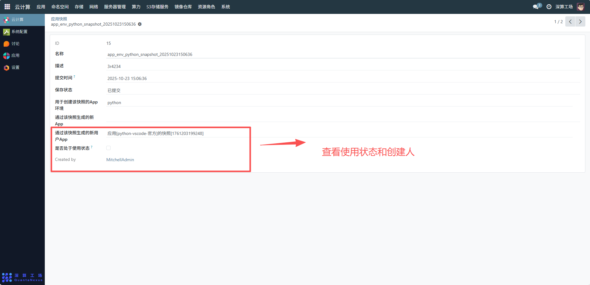

# 应用快照
应用快照主要用于保存应用当前的运行状态（包括环境配置、数据、依赖等），形成一个可恢复的 “状态备份”，核心作用是支持应用环境的版本回溯、故障恢复或快速克隆相同环境。展示系统中创建的所有快照，对模板快照进行搜索、排序、分页浏览，并可对单条记录进行详情查看、编辑、删除等操作
## 1、基础信息查看
- 确认快照 ID：如示例中的「15」，用于唯一标识该快照
- 查看快照名称：如「app_env_python_snapshot_20251023150636」，明确快照归属
- 查看描述信息：可查看了解快照的补充说明
- 确认提交时间：可查看掌握快照创建时间节点
- 查看保存状态：如「已提交」，了解快照当前生命周期阶段

## 2、关联应用信息查看
- 查看用于创建快照的 App 环境：如「python」，明确快照的应用环境来源
- 查看通过快照生成的新用户 App：如「应用 [python-vscode - 官方] 的快照 [1761203199248]」，了解快照的应用衍生关系

## 3、状态与权限查看
- 检查是否处于使用状态：通过复选框确认快照的使用状态
- 查看创建人信息：如「MitchellAdmin」，明确快照的创建账号

