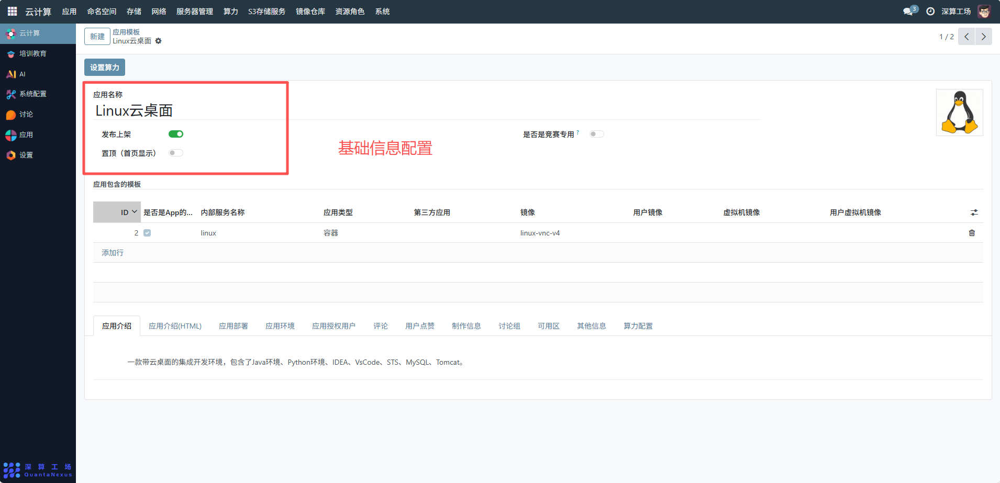
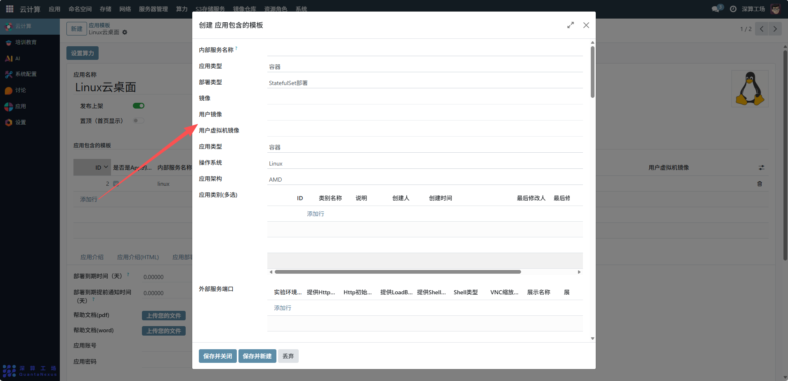
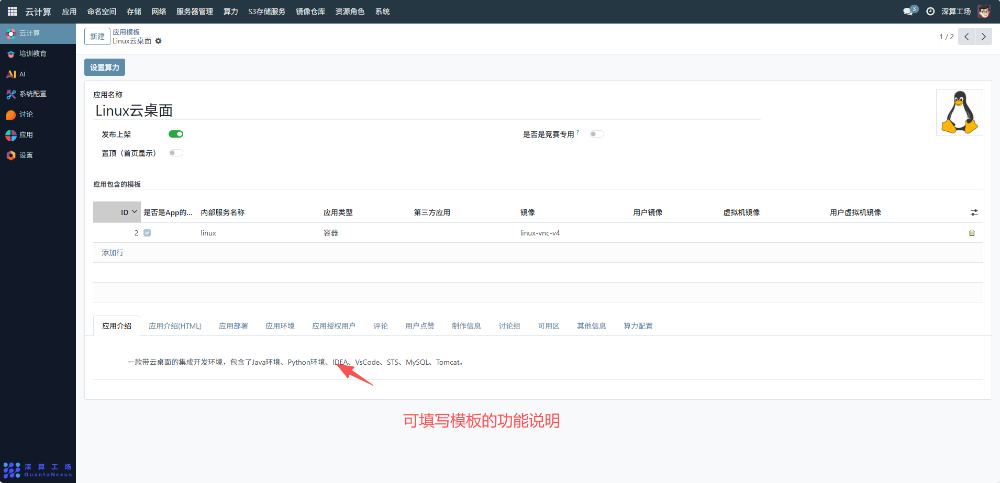
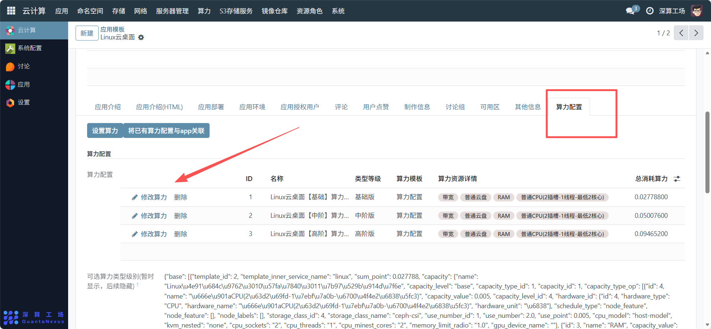
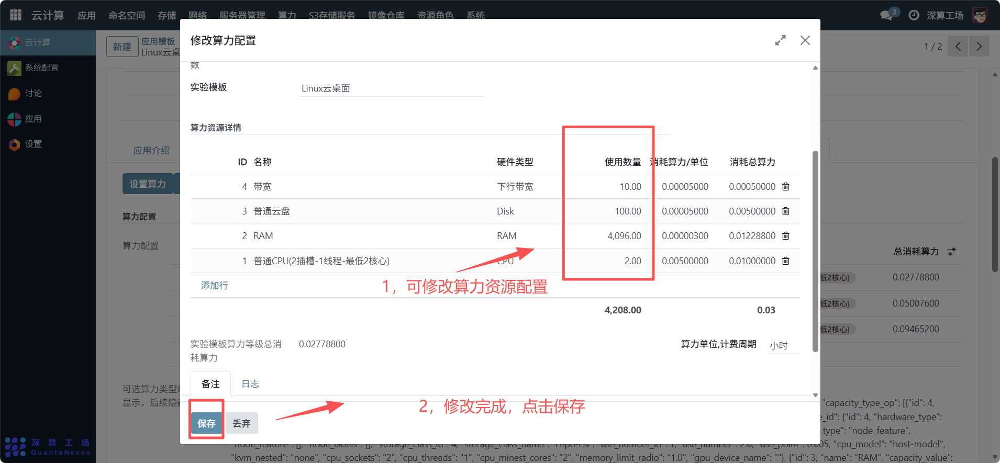
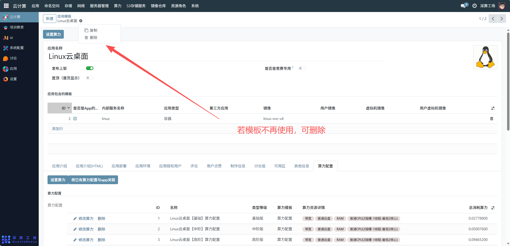

# 公共模板
展这里的 “公共模板”是预先配置好的应用模板，用于快速部署标准化的应用环境（如开发桌面、服务集群等），避免重复配置，提升应用部署的效率与一致性，同时支持多用户共享使用。显示当前系统中已发布的所有应用，对应用进行搜索、排序、分页浏览，并可对单条记录进行详情查看、编辑、删除等操作。
## 1、基础信息配置
应用名称：可查看模板的标识名称（如 “Linux 云桌面”），清晰体现模板用途。
发布上架 / 置顶：
开启 “发布上架”（绿色开关），表示该模板对用户可见，可被部署；
开启 “置顶（首页显示）”，可将模板优先展示在应用列表首页，方便用户快速找到。
竞赛专用标识：若模板仅用于特定竞赛场景，开启 “是否是竞赛专用” 开关，限制模板的使用范围

。
## 2、模板内容配置（应用包含的模板）
添加 / 关联模板组件：点击 “添加行”，配置模板的核心组件：
内部服务名称：填写模板对应的服务标识（如示例中的 “linux”）；
应用类型：选择模板的部署类型（如 “容器”“虚拟机”，示例中为容器）；
镜像 / 用户镜像：关联模板依赖的基础镜像（如示例中的 “linux-vnc-v4”），确保应用运行的环境一致；
（可选）关联 “虚拟机镜像 / 用户虚拟机镜像”：若模板是虚拟机类型，配置对应的虚拟机镜像。

## 3、扩展信息配置（标签页）
应用介绍：填写模板的功能说明（如示例中 “包含 Java/Python 环境、IDE 工具”），帮助用户了解模板用途。
应用部署 / 应用环境：关联该模板对应的部署规则、运行环境配置，确保模板部署时自动匹配资源策略。
可用区 / 算力配置：指定模板可部署的可用区，配置模板的算力消耗规则（如每小时消耗的算力点数），用于资源计量与计费。

## 4、模板的维护与管理
更新模板：修改模板的镜像、资源配置后，保存即可同步到后续基于该模板的新部署实例；
删除模板：若模板不再使用，可删除（注意：需先清理所有基于该模板的应用实例，避免依赖错误）；

