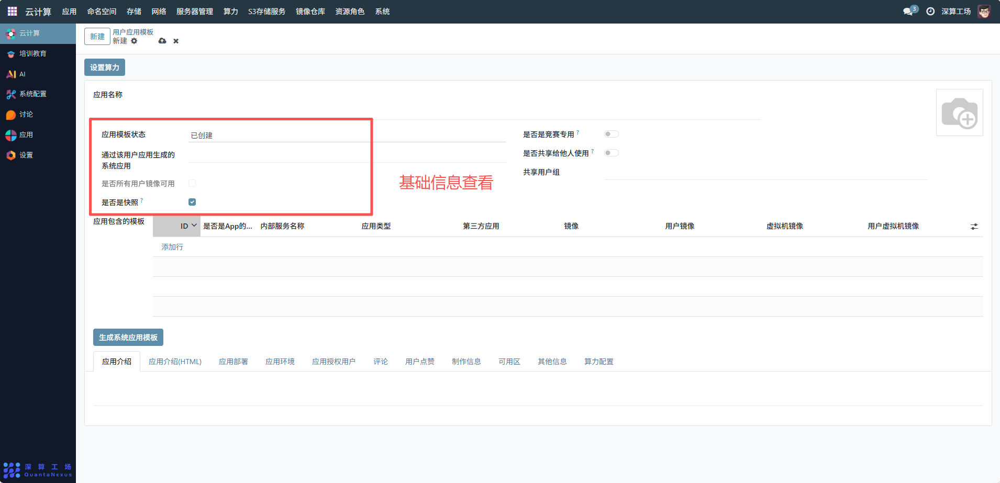
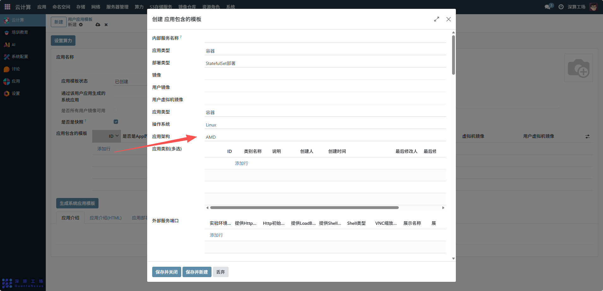
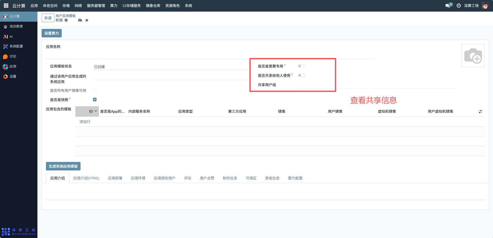
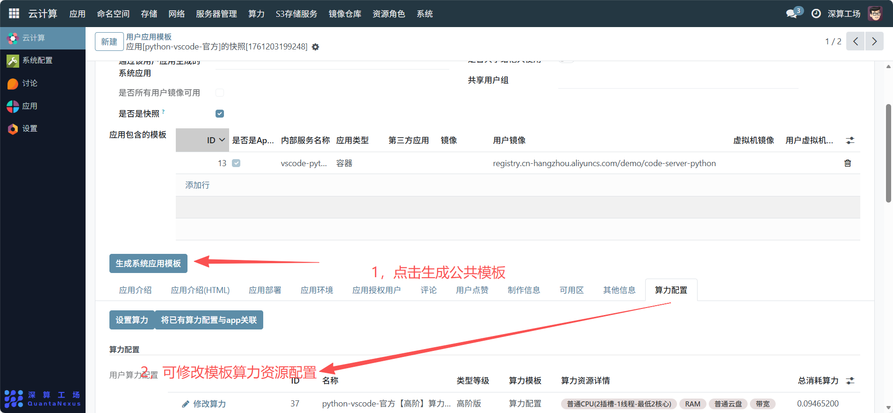

# 用户应用模板
用户应用模板是用户自定义的个性化应用模板，用于封装用户自己配置的应用环境（如定制化开发桌面、私有服务集群），支持保存为模板后复用、共享，满足用户个性化的应用部署需求，展示当前系统中用户创建的所有应用模板，对应用进行搜索、排序、分页浏览，并可对单条记录进行详情查看、编辑、删除等操作。
## 1、基础信息配置
- 应用名称：可查看模板的名称（如 “我的 Python 开发环境 v2”），区分不同自定义模板；
- 应用模板状态：系统自动标记为 “已创建”，表示模板处于可编辑状态；
竞赛 / 快照标识：
- 开启 “是否是竞赛专用”：限制模板仅用于竞赛场景；
- 勾选 “是否是快照”：表示该模板是从现有应用状态快照生成的，可快速恢复原环境。

## 2、模板内容配置
应用包含的模板：点击 “添加行”，配置模板的核心组件：
填写 “内部服务名称”“应用类型”（如容器 / 虚拟机）；
关联 “镜像 / 用户镜像”（选择自己上传的自定义镜像）或 “虚拟机镜像 / 用户虚拟机镜像”；
（可选）关联 “第三方应用”：集成外部服务依赖。

## 3、共享与权限配置
是否共享给他人使用：开启开关后，可选择 “共享用户组”，将模板开放给指定用户组使用；
是否所有用户镜像可用：勾选后，该模板支持使用所有用户上传的镜像（否则仅用自己的镜像）。

## 4、生成与维护
生成系统应用模板：配置完成后，点击 “生成系统应用模板” 按钮，将当前配置保存为可用公共模板；
扩展配置（标签页）：通过 “应用部署 / 应用环境 / 算力配置” 等标签页，补充模板的部署规则、运行环境、算力消耗等信息；

