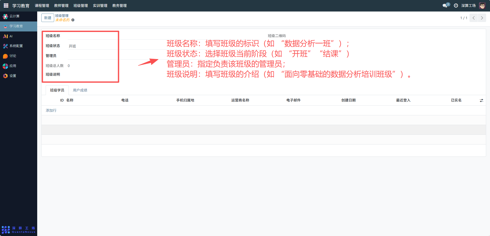
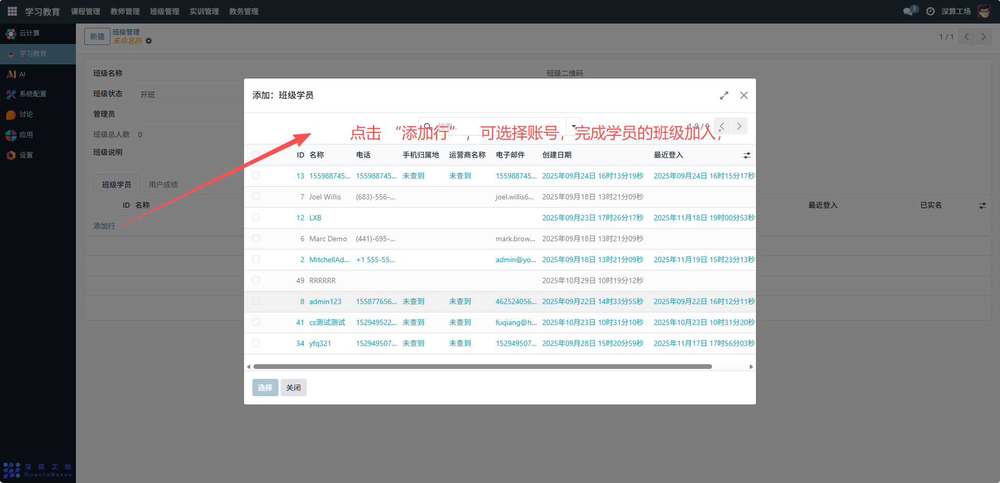
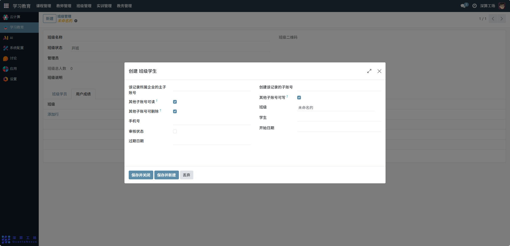

# 班级管理
“班级管理” 是学习教育平台中班级组织的全流程管理工具，核心作用是创建并维护班级的基础信息、成员列表、管理权限，实现班级的组建、成员管理与状态管控，是支撑班级化教学与学员管理的核心组织模块。
## 1、班级基础信息配置
- 班级名称：填写班级的标识（如 “数据分析一班”）。
- 班级状态：选择班级当前阶段（如 “开班”“结课”）。
- 管理员：指定负责该班级的管理员；
- 班级说明：填写班级的介绍（如 “面向零基础的数据分析培训班级”）。

## 2、班级成员管理
- 班级学员（表格）：点击 “添加行”，填写学员的 ID、名称、电话、电子邮箱等信息，完成学员的班级加入。
- 班级总人数：系统自动统计学员数量，直观展示班级规模。

## 3、学员数据关联
- 用户成绩：切换到该标签页，关联学员的课程成绩，集中管理学习数据。

