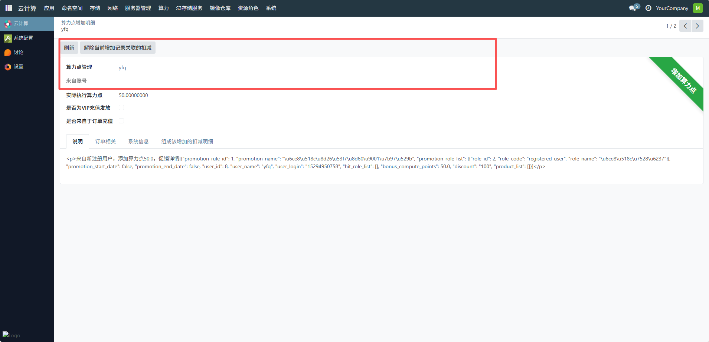
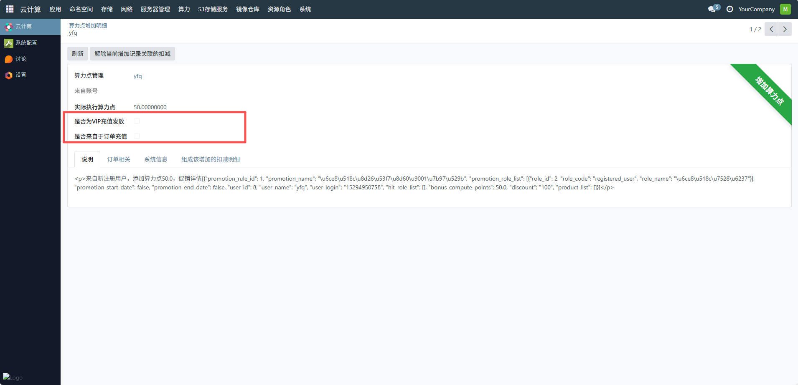
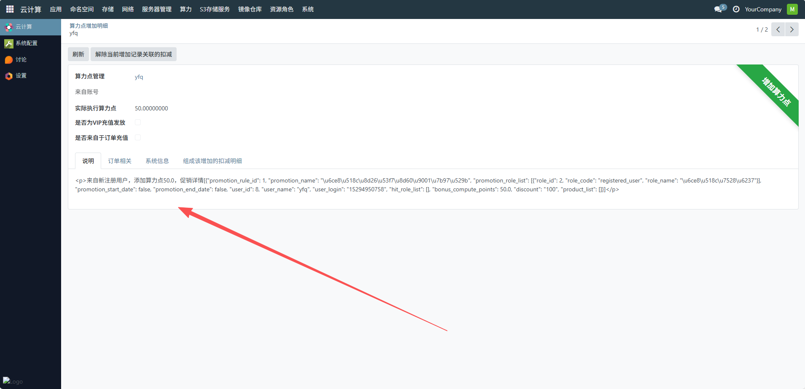
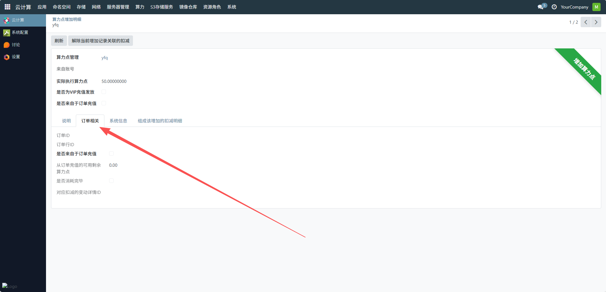
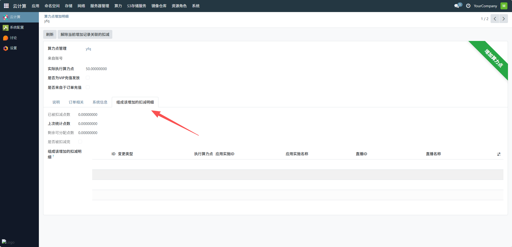
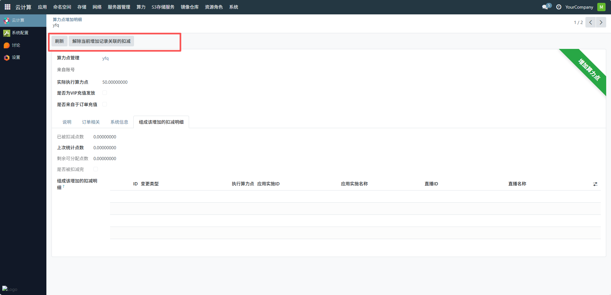

# 增加明细
用于集中展示所有用户的算力点增加记录，明确每个用户的 “增加算力点” 数量与发放状态（如是否为 VIP 充值、是否被扣减完），确保算力资源发放的透明性与合规性，通过 “剩余可分配点数”“已被扣减点数” 等字段，帮助管理员掌握算力资源的剩余情况，为后续资源发放与调度提供依类界面为平台管理员提供了算力资源发放的完整视图，助力算力资源的精细化运营与用户激励策略的优化。
## 1、确认基础信息
- 算力点管理用户：确认当前操作的用户（如示例中的 “yfq”），确保为目标用户增加算力点。
- 实际执行算力点：核对显示的增加算力点数值（如示例中的 “50”），确认与预期增加的数量一致。
- 来源账号：若算力点来自其他关联账号，在此处补充对应账号信息；若无则保持为空。

## 2、标记增加类型
- 是否为 VIP 充值发放：若本次增加的算力点是 VIP 用户的充值福利，勾选此选项；否则保持未勾选。
- 是否来自于订单充值：若算力点增加源于用户的订单支付（如购买算力套餐），勾选此选项；若为其他场景（如新用户赠送）则不勾选。

## 3、填写说明信息
- 切换至 “说明” 标签页，填写算力点增加的原因及详情，例如：
- 新用户注册赠送：“新注册用户首次登录，赠送 50 算力点”。
- 订单充值：“用户购买基础算力套餐，充值 100 元兑换 100 算力点”。
- 活动奖励：“参与 XX 活动，奖励 20 算力点”。

## 4、关联订单或系统信息
- 订单相关：切换至 “订单相关” 标签页，若算力点增加与订单关联，填写对应的订单号、支付金额等信息。
- 系统信息：切换至 “系统信息” 标签页，确认系统自动记录的操作时间、操作人员等日志信息，确保记录完整。

## 5、管理关联的扣减明细
若本次增加的算力点后续需要关联扣减记录（如限时算力点到期扣减），可切换至 “组成该增加的扣减明细” 标签页，添加或关联对应的扣减规
则及记录。

## 6、刷新或解除关联
点击 “刷新” 按钮，更新当前页面的最新数据，确保信息同步。
若需取消本次增加记录与关联扣减的绑定，点击 “解除当前增加记录关联的扣减” 按钮

