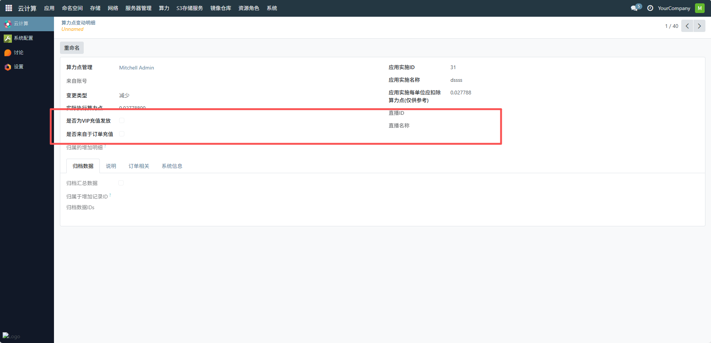
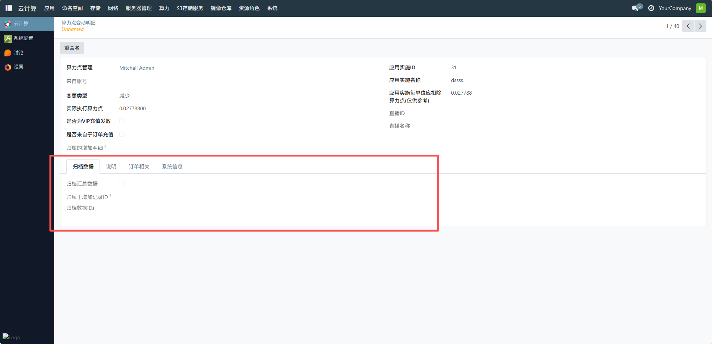

# 变动明细
用于集中展示所有用户的算力点变动记录，记录所有用户的算力点消耗明细，实现平台级算力资源变动的集中管理，为平台管理员提供了算力资源流动的完整视图，助力算力成本优化、资源调度决策与用户计费的精准管理，点击可查看单个算力点变动的明细。
## 1、查看基础信息
确认算力点变动的基础信息，包括算力点管理用户、变更类型（如示例中为 “减少”）、实际执行算力点、应用实施 ID / 名称及对应的每单位扣除算力点等，确保信息与变动场景匹配。

## 2、补充分类信息
- 是否为 VIP 充值发放：根据变动来源，勾选对应的选项（如非 VIP 充值发放则保持未勾选）。
- 是否来自于订单充值：同理，根据变动是否源于订单充值勾选对应选项。
- 直播 ID / 名称：若变动与直播业务相关，可查看对应的直播 ID 和名称；否则保持为空。

## 3、归档与说明配置
- 归档数据：勾选 “归档汇总数据”，并填写 “归属于增加记录 ID”“归档数据 IDs” 等归档信息，完成数据归档管理。
- 说明 / 订单相关 / 系统信息：切换至 “说明” 标签页，填写变动的原因说明（如 “应用 dssss 算力消耗”）；切换至 “订单相关” 标签页，关联对应的- 订单信息（若有）；切换至 “系统信息” 标签页，确认系统自动记录的变动时间、操作人等信息。

