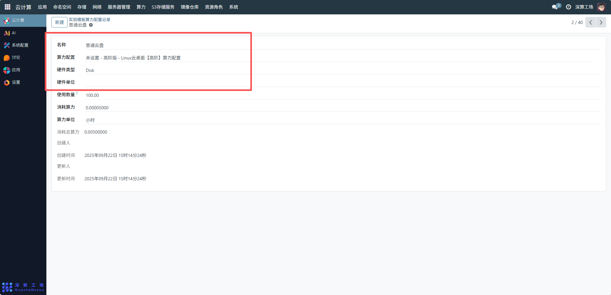
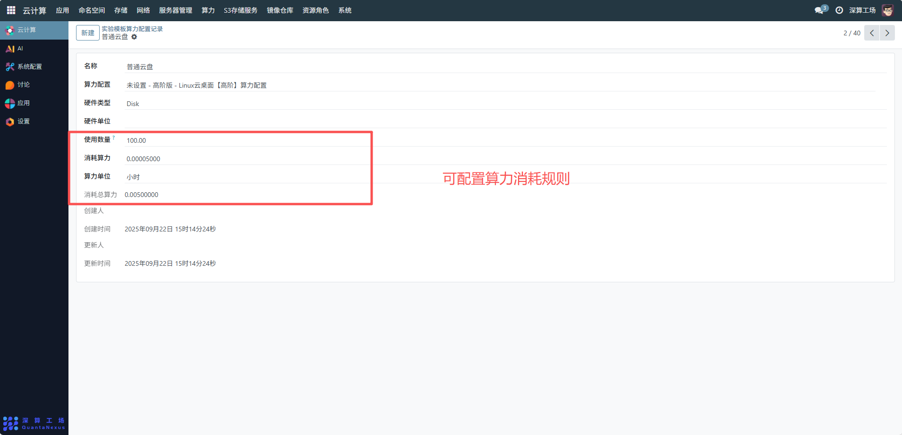
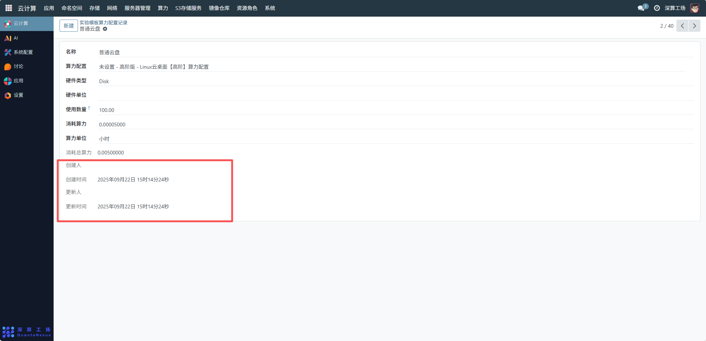

# 实验模板算力配置记录
实验模板算力配置记录主要用于记录实验模板所关联的算力资源配置信息，包括算力的消耗规则、硬件类型、使用数量等，便于对实验过程中算力资源的使用进行统计、计费和管理，确保算力资源的合理分配与成本核算。
## 1、基础信息
- 名称：可查看并编辑实验模板算力配置的标识名称，如 “普通云盘算力配置”，用于区分不同的算力配置记录。
- 算力配置：可查看并编辑关联的算力配置模板（如 “高阶版 - Linux 云桌面【高阶】算力配置”），明确该实验模板所使用的算力规格。
- 硬件类型：可查看并编对应的硬件类型，如示例中的 “Disk”（云盘），标识算力资源对应的硬件载体。
- 硬件单位：可查看并编硬件类型填写单位。

## 2、算力消耗规则配置
- 使用数量：设置实验模板中该硬件的使用数量，如示例中的 “100.00”，表示云盘的使用数量为 100。
- 消耗算力：配置单位数量硬件每单位时间消耗的算力，如示例中的 “0.00005000”（每小时每单位云盘消耗的算力）。
- 算力单位：选择算力的计时单位，如 “小时”，明确算力消耗的时间维度。
- 消耗总算力：系统会根据 “使用数量 × 消耗算力 × 时间” 自动计算消耗的总算力（示例中为 “0.00500000”），用于算力资源的总量统计。

## 3、追溯与管理
界面中的 “创建人 / 时间”“更新人 / 时间” 为系统自动记录的操作信息，用于追溯该算力配置记录的创建和变更历史，便于权限管理和操作审计。

