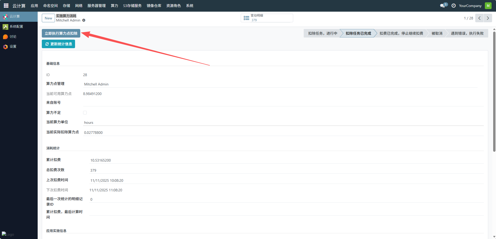
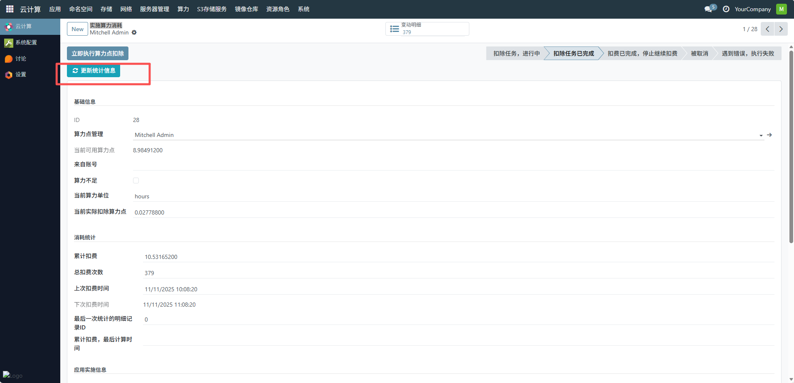
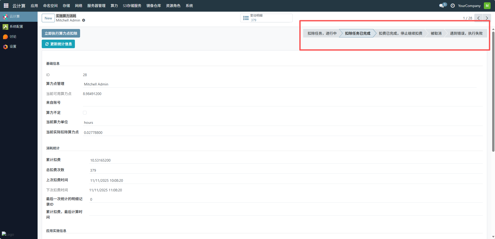

# 实施算力消耗
用于集中展示所有用户的算力消耗明细，平台管理员提供了算力资源消耗的全局视角，助力算力成本核算、资源优化调度与用户计费的精准管理，点击可查看单个应用实施的详情。
## 1、查看基础信息
确认当前算力消耗的基础信息，包括ID、算力点管理用户、当前可用算力点、当前算力单位（如示例中为 “hours”）、当前实际扣除算力点等，确保信息与待实施的算力消耗场景匹配。

## 2、执行算力点扣除
点击立即执行算力点扣除按钮，触发算力点的扣除流程。系统会根据预设的算力消耗规则（如应用算力配置、计费周期等）自动计算并扣除对应算力点。

## 3、更新统计信息
若需实时更新算力消耗的统计数据，点击更新统计信息按钮，系统会同步最新的累计扣费、总扣费次数、上次扣费时间、下次扣费时间等统计信息。

## 4、监控扣除任务状态
在界面上方的状态栏中，可查看扣除任务的进度，包括 “扣除任务，进行中”“扣除任务已完成”“扣费已完成，停止继续扣费” 等状态，确保算力消耗流程正常执行

