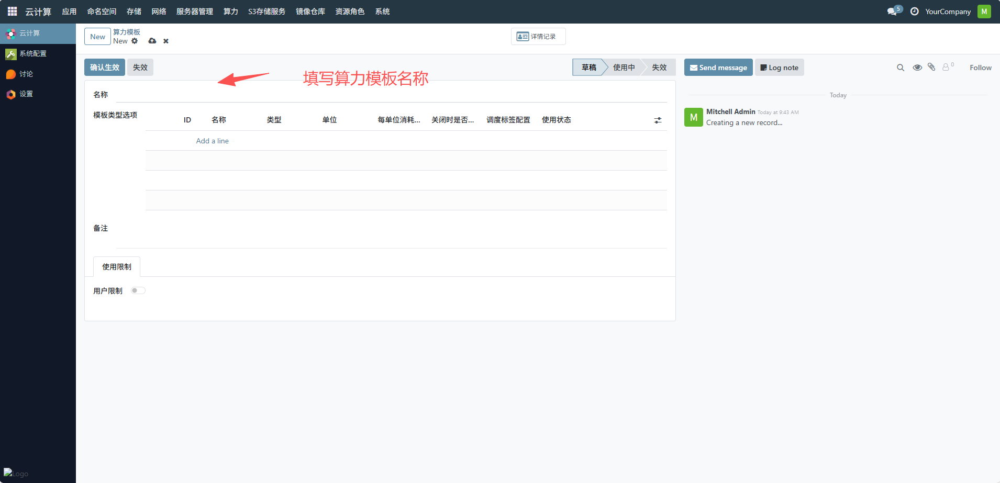
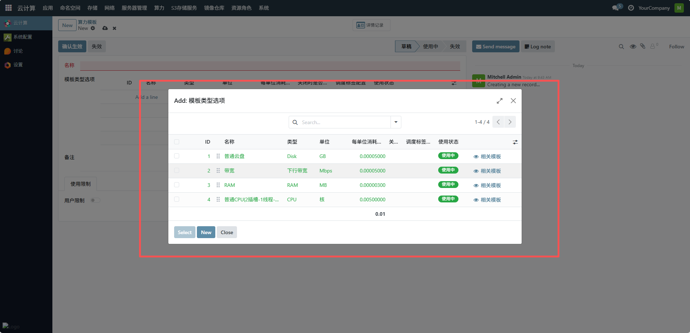
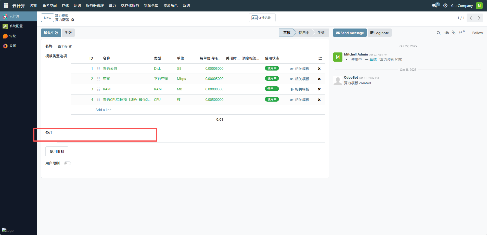
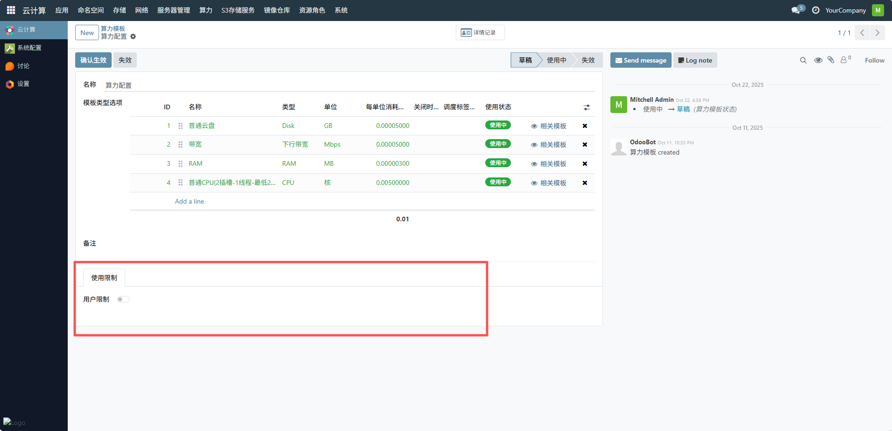
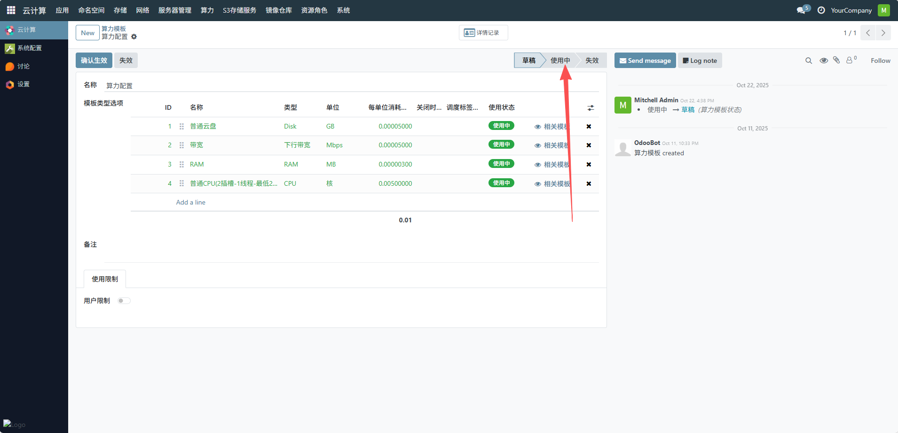

# 算力模板
管理员可通过算力模板管理界面快速定位目标模板，从而实现对算力资源模板的集中管理，确保应用部署时能够快速匹配到合适的算力配置，提升资源调度效率。下面是配置算力模板一个完整的流程。
## 1、填写算力模板名称
在 “名称” 输入框中输入该算力模板的名称，用于标识模板

## 2、配置模板类型选项
点击添加模板类型选项

## 3、填写备注
在 “备注” 输入框中填写该算力模板的说明信息，如模板的适用场景、版本说明等

## 4、配置使用限制
用户限制：若需对使用该模板的用户进行限制，开启 “用户限制” 开关，然后配置具体的用户限制规则（如指定可使用的用户或用户组）

## 5、确认生效
完成上述配置后，点击 “确认生效” 按钮，使该算力模板从 “草稿” 状态变为 “使用中”，即可投入使用。

