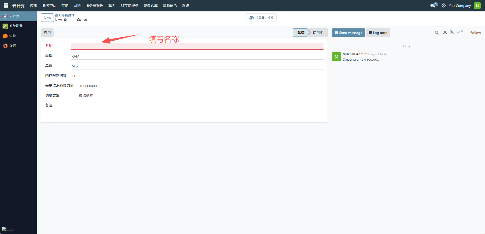
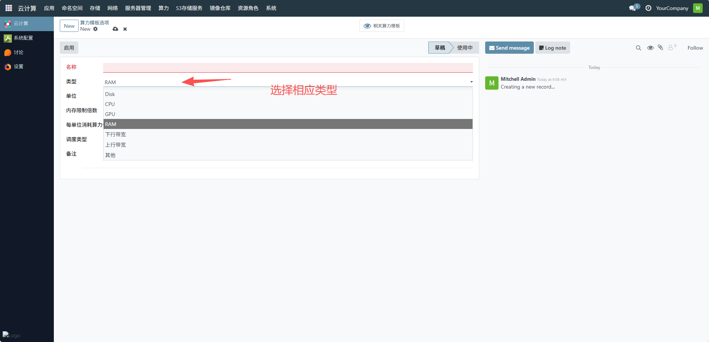
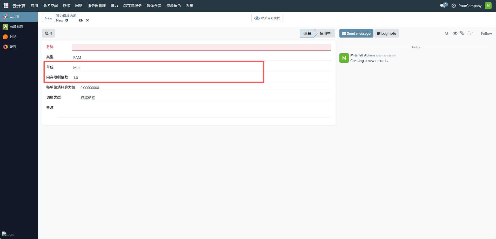
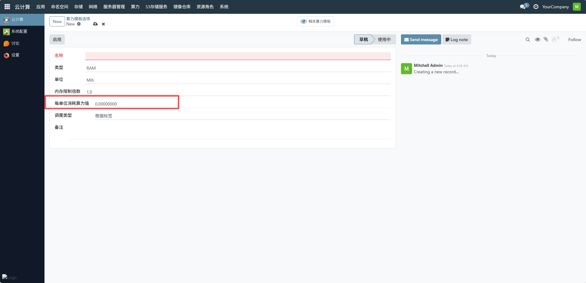
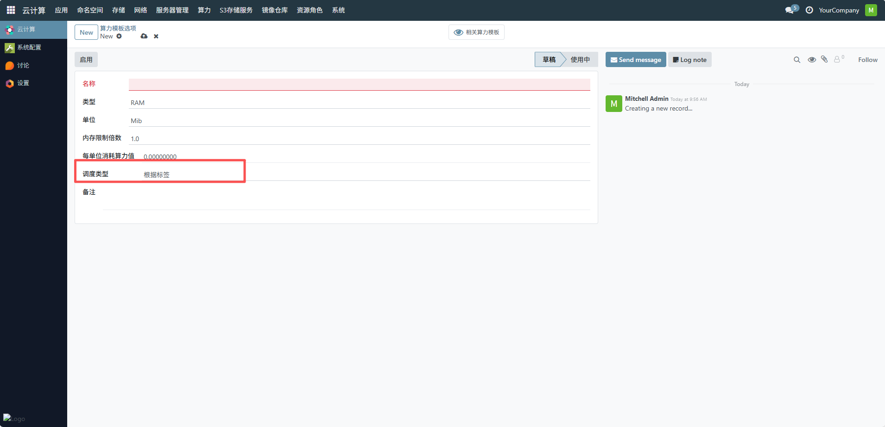
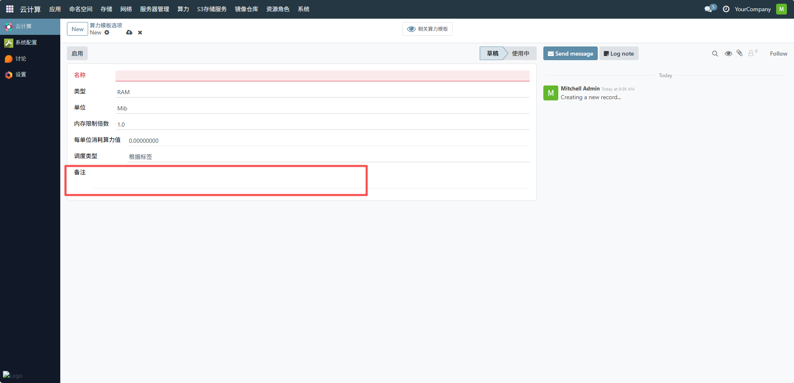
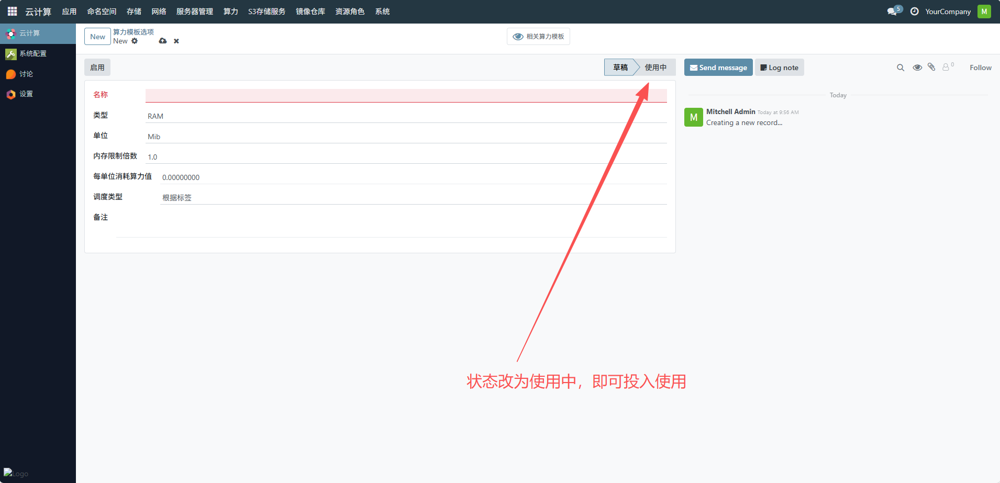

# 算力模板选项
管理员通过此界面可直观掌握各类算力资源的消耗标准与可用状态，便于在创建算力模板时快速组合所需资源，实现算力资源的精细化管理与高效调度。下面是配置算力模板选项一个完整的流程。
## 1、填写名称
在 “名称” 输入框中输入该算力模板选项的名称，用于标识该选项，例如 “内存算力选项 v1”。

## 2、选择类型
点击 “类型” 下拉框，选择对应的算力类型，如示例中选择 “RAM”（内存），也可根据需求选择 “CPU”“GPU”“Disk”（磁盘）、“下行带宽”“上行带宽” 或 “其他” 类型。

## 3、设置单位
在 “单位” 输入框中填写该算力类型的计量单位，例如选择 “RAM” 类型时，单位可填 “GB”。

## 4、配置每单位消耗算力值
在 “每单位消耗算力值” 输入框中填写每单位该算力的消耗参数，根据实际资源消耗情况填写数值，例如内存每 GB 的算力消耗值。

## 5、确认调度类型
默认调度类型为 “根据标签”，若无需修改可保持默认。

## 6、填写备注
在 “备注” 输入框中填写该算力模板选项的说明信息，如适用场景、配置说明等。

## 7、启用模板选项
配置完成后，点击 “启用” 按钮，使该算力模板选项从 “草稿” 状态变为 “使用中”，即可投入使用。

