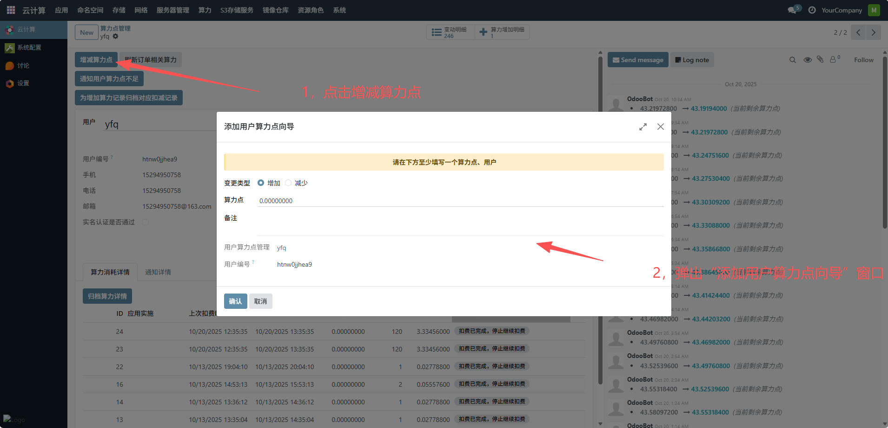
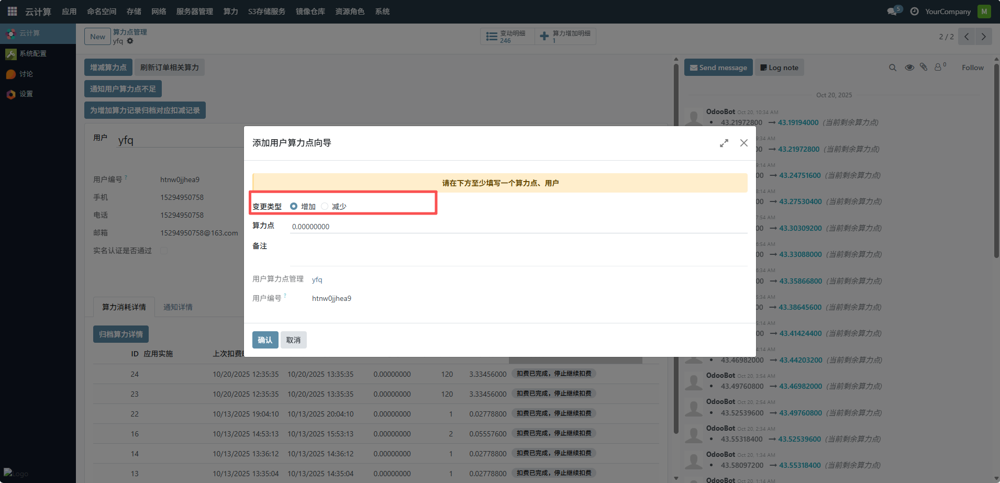
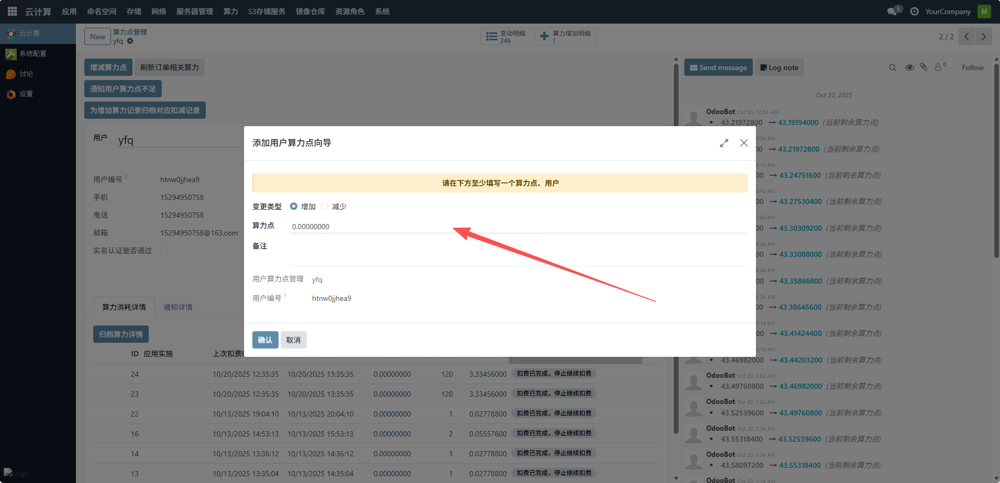
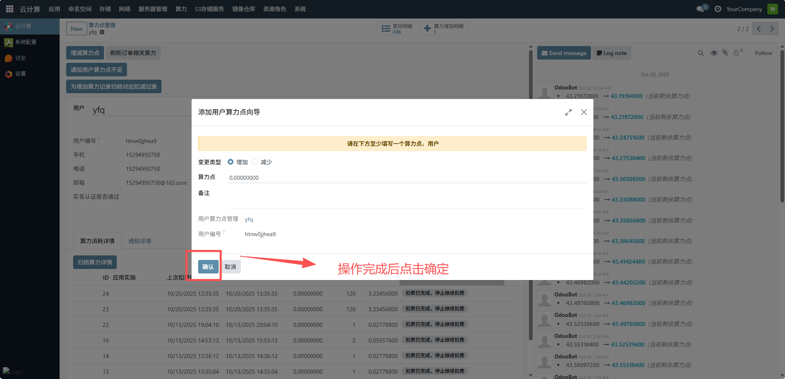

# 算力点管理
管理员通过此界面可集中管理用户的算力点资源配额，跟踪算力消耗与变动情况，确保算力资源的合理分配与高效利用，为用户提供透明、可控的算力资源服务，下面是一个增加和减少算力点的过程。
## 1、打开算力点调整界面
在算力点管理页面，点击增减算力点按钮，弹出 “添加用户算力点向导” 窗口。

## 2、选择变更类型
- 若要增加算力点，选中 “增加” 单选按钮。
- 若要减少算力点，选中 “减少” 单选按钮。

## 3、输入算力点数值
在 “算力点” 输入框中，填写需要增加或减少的具体算力点数值（例如增加 50 则输入 “50”，减少 10 则输入 “10”）。

## 4、填写备注
在 “备注” 输入框中，填写本次算力点调整的说明（如 “购买套餐增加算力”“资源回收减少算力” 等），便于后续追溯。

## 5、确认用户信息
界面会自动加载当前操作的用户信息（如用户名、用户编号），确认无误后，点击窗口底部的确认按钮，操作完成后，系统会自动更新用户的剩余算力点，并在右侧日志区域记录算力点的变更明细。

