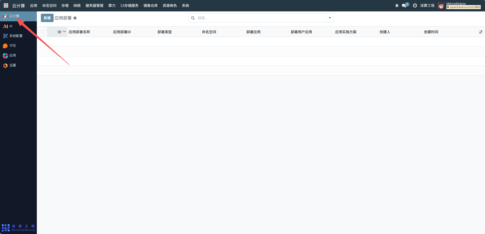

# 云计算
### 概述
深算工场后台的“云计算”管理模块包含了用于部署各种实验环境的“应用”。应用用于定义部署一个实验环境的完整过程。 当我们选择使用一个应用后，就可以使用这个应用来一键搭建我们的实验环境。
1，统一管理算力：整合 GPU、芯片等异构资源，通过智能调度实现万卡级集群的高效利用，满足大模型训练、科研计算等对高算力的需求。
2，全生命周期管理实验环境：支持实验环境的创建、部署、监控和运维，可管理环境 ID、IP、状态等关键参数，方便用户快速定位和操作资源。
3，资源隔离与安全管控：通过命名空间机制实现不同项目 / 用户的资源隔离，保障数据和算力使用的安全性。
4，适配多场景需求：既能支撑高校科研实训（如一键创建实验环境、资源配额管理），也能满足商业化运营（如用户自主注册、算力充值）。
