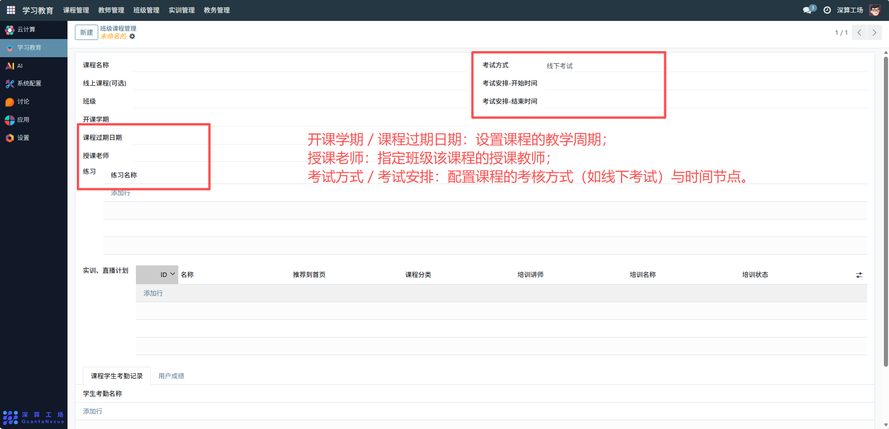
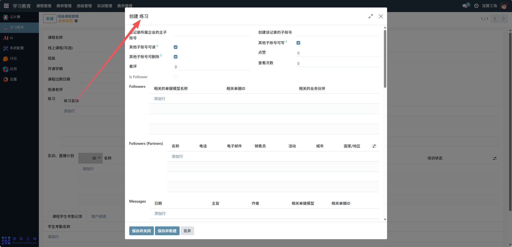
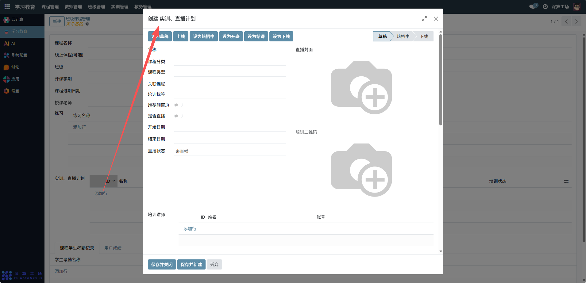
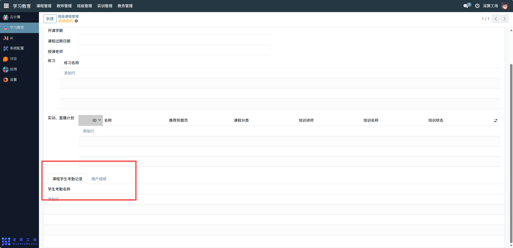

# 班级课程
“班级课程管理” 是学习教育平台中班级与课程关联的综合管理工具，核心作用是将课程与具体班级绑定，统一配置班级课程的教学安排（如授课、考试、实训）、学员管理（考勤、成绩），实现班级维度的课程教学全流程管控，是支撑班级化教学的核心模块。
## 1、课程与班级基础关联
- 课程名称：选择要分配的课程；
- 班级：选择对应的教学班级，完成课程与班级的绑定；
- 线上课程 (可选)：关联该课程的线上资源（如视频、课件）

## 2、教学计划配置
- 开课学期 / 课程过期日期：设置课程的教学周期；
- 授课老师：指定班级该课程的授课教师；
- 考试方式 / 考试安排：配置课程的考核方式（如线下考试）与时间节点。

## 3、配套资源关联
- 练习：点击 “添加行”，关联课程对应的练习资源（如课后作业）；
- 实训、直播计划：点击 “添加行”，配置班级的实训、直播教学安排。

## 4、学员数据管理
- 课程学生考勤记录：查看学员考勤信息，跟踪出勤情况；
- 用户成绩：记录学员的课程成绩，评估学习效果。

