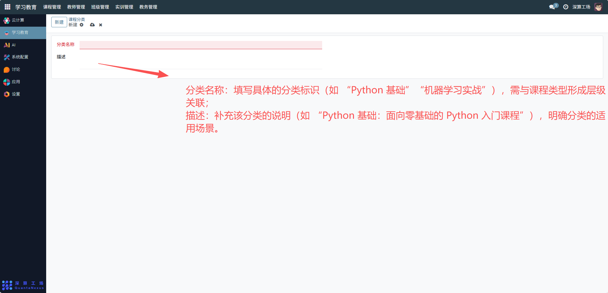

# 课程分类
“课程分类” 是学习教育平台中课程的二级分类工具，核心作用是在 “课程类型” 的基础上进一步细化课程的分类维度（比如在 “编程课” 类型下新增 “Python 基础”“Java 进阶” 等分类），实现课程资源的更精准归类与检索，是课程体系结构化管理的补充工具。
## 1、分类基础信息配置
- 分类名称：填写具体的分类标识（如 “Python 基础”“机器学习实战”），需与课程类型形成层级关联；
- 描述：补充该分类的说明（如 “Python 基础：面向零基础的 Python 入门课程”），明确分类的适用场景。

