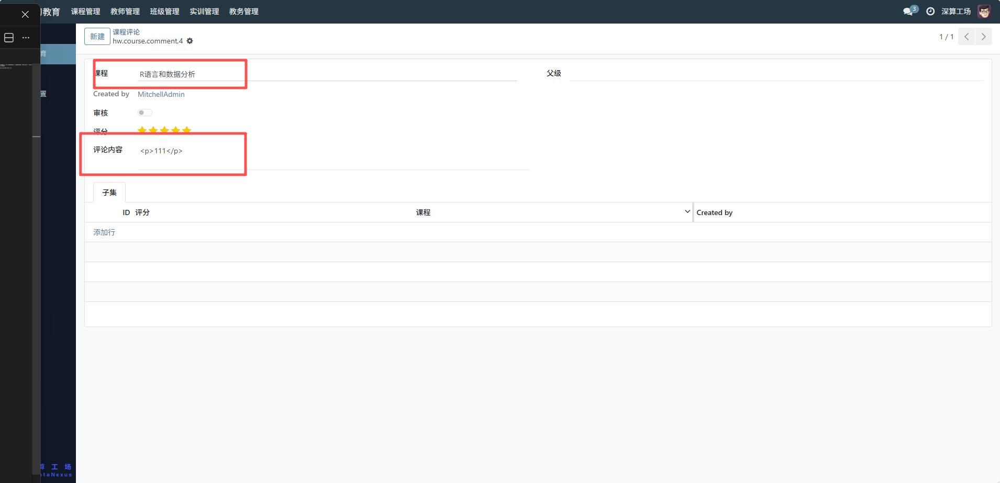

# 课程评论
“课程评论” 是学习教育平台中课程互动与口碑管理的工具，核心作用是集中管理学员对课程的评分、评论内容，并通过审核机制管控评论的展示，实现课程口碑的收集、筛选与展示，是连接学员反馈与课程优化的核心互动模块。
## 1、评论基础关联配置
- 课程：可查看编辑评论对应的课程（如 “R 语言和数据分析”），明确评论的归属；
- Created by：记录评论的发布学员，定位反馈的来源。

