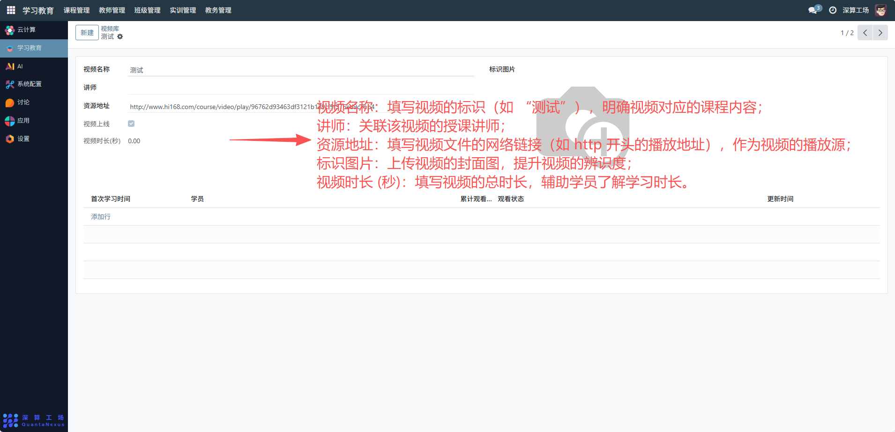
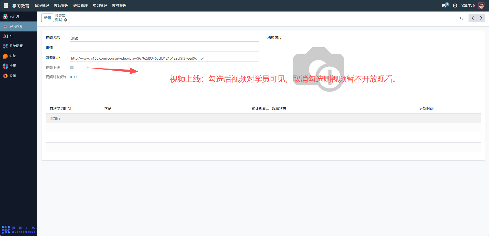
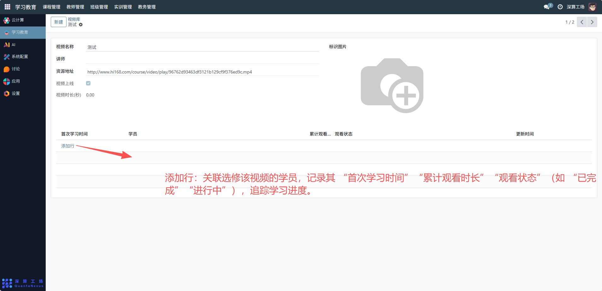

# 视频库
“视频库” 是学习教育平台中课程视频资源的管理工具，核心作用是集中配置、存储课程相关的视频资源，并追踪学员的观看数据，实现视频资源的上传、发布与学习状态的统一管控，是支撑线上课程教学的核心资源模块。
## 1、视频基础信息配置
- 视频名称：填写视频的标识（如 “测试”），明确视频对应的课程内容；
- 讲师：关联该视频的授课讲师；
- 资源地址：填写视频文件的网络链接（如 http 开头的播放地址），作为视频的播放源；
- 标识图片：上传视频的封面图，提升视频的辨识度；
- 视频时长 (秒)：填写视频的总时长，辅助学员了解学习时长。

## 2、视频发布状态配置
- 视频上线：勾选后视频对学员可见，取消勾选则视频暂不开放观看。

## 3、学员观看数据管理
- 添加行：关联选修该视频的学员，记录其 “首次学习时间”“累计观看时长”“观看状态”（如 “已完成”“进行中”），追踪学习进度。

