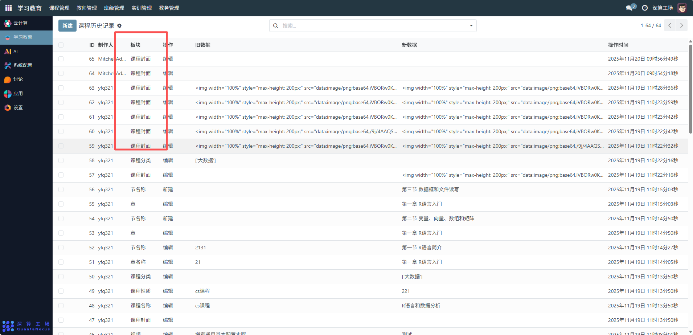
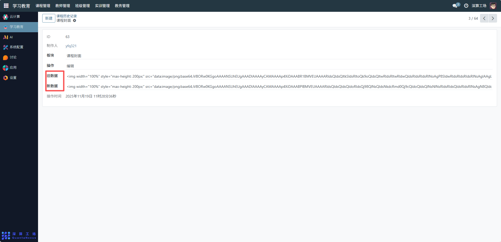

# 课程历史记录
“课程历史记录” 是课程管理的操作审计工具，核心作用是记录课程相关的所有修改操作（如编辑课程封面、新增章节、修改课程名称等），保存操作前后的数据、操作人及时间，实现课程配置变更的可追溯、可审计，是保障课程信息安全与管理规范的辅助工具。
## 1、操作追溯
记录每一次课程修改的 “板块”（如课程封面、章节）、“操作”（编辑 / 新建）、“旧数据” 与 “新数据”，明确变更内容；

## 2、数据恢复参考
若课程配置错误，可通过历史记录中的 “旧数据” 恢复之前的正确配置；

