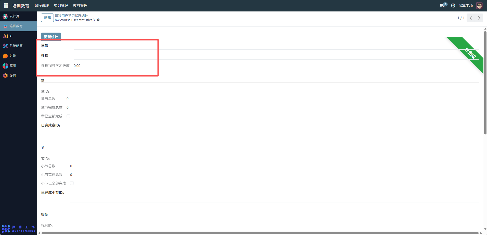
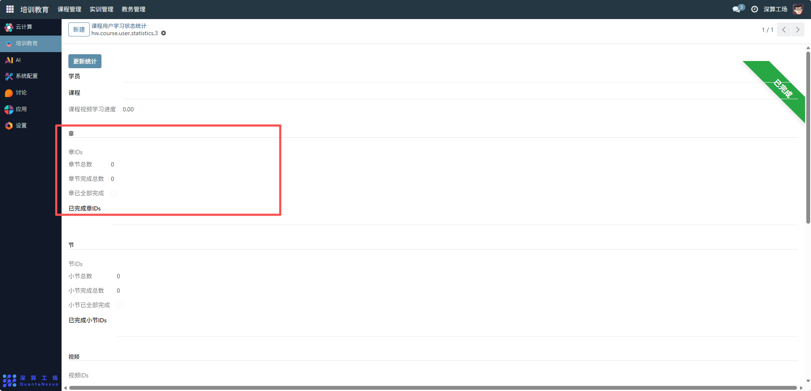
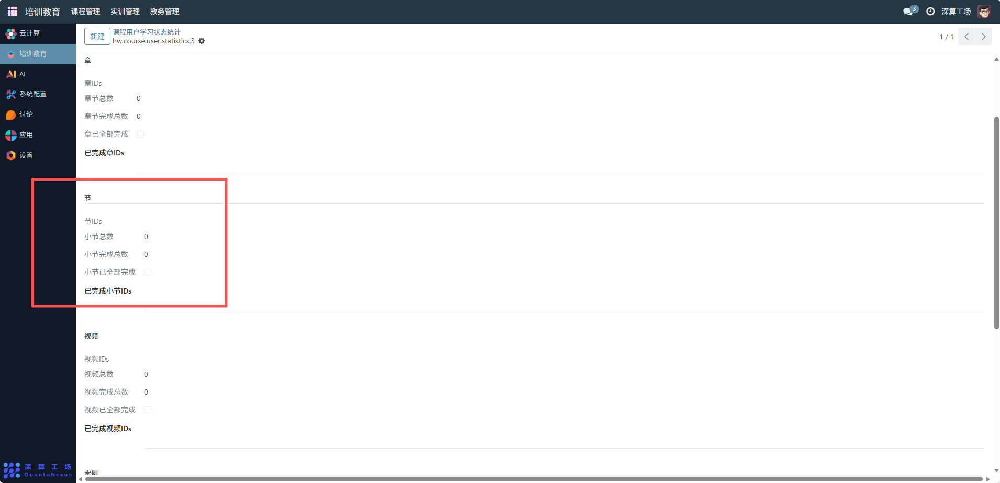
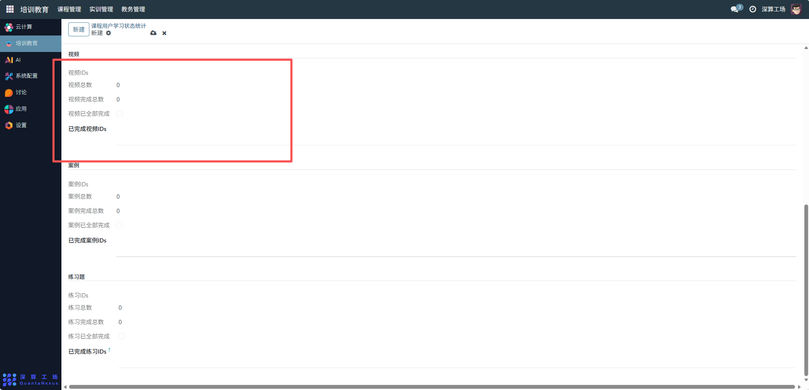
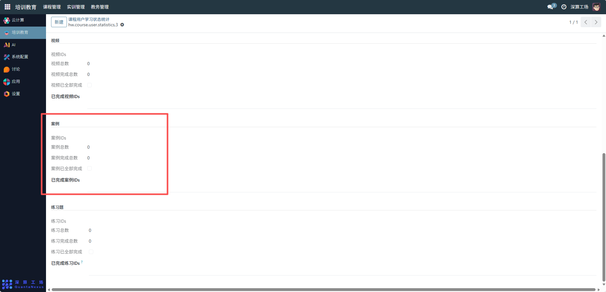
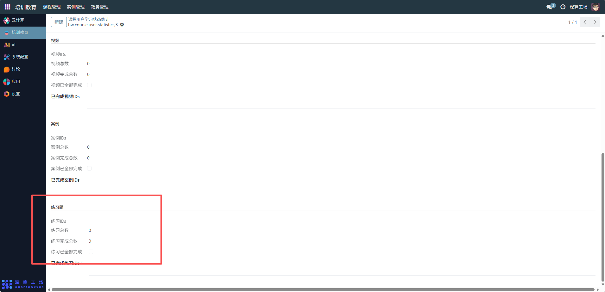

# 课程用户学习状态统计
“课程用户学习状态统计” 是学习教育平台中用户课程学习数据的精细化统计工具，核心作用是按资源类型（视频、案例、练习题）拆分用户的学习完成情况，量化学习进度、标记完成状态，实现对用户学习过程的精准跟踪与课程学习效果的评估，是支撑学习管理与课程优化的核心数据模块。
## 1、基础关联配置
- 学员：选择要统计的目标学员，明确统计主体；
- 课程：关联对应的课程，确定统计的课程范围；
- 课程视频学习进度：自动同步学员在课程视频资源的整体学习进度（如 0.00 代表未开始）。

## 2、“章” 层级统计配置
- 章 IDs：关联课程下的所有章资源 ID，明确章的统计范围；
- 章节总数：系统自动统计关联的章数量；
- 章节完成总数：自动同步学员已完成的章数量；
- 章已全部完成：当 “章节完成总数” 等于 “章节总数” 时，勾选该开关标记章层级全部完成；
- 已完成章 IDs：自动记录学员完成的章资源 ID。

## 3、“节” 层级统计配置
- 节 IDs：关联课程下的所有节资源 ID，明确节的统计范围；
- 小节总数 / 小节完成总数：自动统计节的总量与学员完成量；
- 小节已全部完成：完成数等于总数时勾选，标记节层级全部完成；
- 已完成小节 IDs：记录学员完成的节资源 ID。

## 4、视频资源统计配置
- 视频 IDs：关联课程下的所有视频资源 ID，明确统计范围；
- 视频总数：系统自动统计关联的视频数量；
- 视频完成总数：自动同步用户已完成的视频数量；
- 视频已全部完成：当 “视频完成总数” 等于 “视频总数” 时，勾选该开关标记完成状态；
- 已完成视频 IDs：自动记录用户完成的视频资源 ID。

## 5、案例资源统计配置
- 案例 IDs：关联课程下的所有案例资源 ID；
- 案例总数 / 案例完成总数：自动统计案例的总量与用户完成量；
- 案例已全部完成：完成数等于总数时勾选，标记案例资源全部完成；
- 已完成案例 IDs：记录用户完成的案例资源 ID。

## 6、练习题资源统计配置
- 练习 IDs：关联课程下的所有练习题资源 ID；
- 练习总数 / 练习完成总数：自动统计练习题的总量与用户完成量；
- 练习已全部完成：完成数等于总数时勾选，标记练习题资源全部完成；
- 已完成练习 IDs：记录用户完成的练习题资源 ID。

