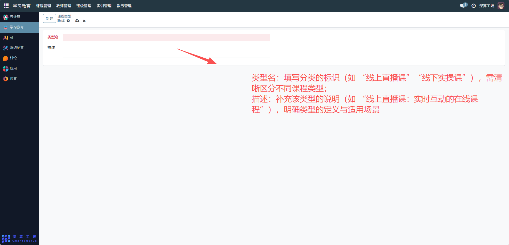

# 课程类型
“课程类型” 是学习教育平台中课程的分类模板工具，核心作用是定义课程的分类标准（如 “线上课”“实操课”），为后续创建课程时选择类型提供统一的分类框架，实现课程的结构化归类与高效检索。
## 1、课程类型基础配置
- 类型名：填写分类的标识（如 “线上直播课”“线下实操课”），需清晰区分不同课程类型；
- 描述：补充该类型的说明（如 “线上直播课：实时互动的在线课程”），明确类型的定义与适用场景。

