# 课程管理
“课程管理” 是学习教育平台中课程全生命周期的管理工具，核心作用是集中配置课程的基础信息、内容结构、运营状态，实现课程从创建、发布到运维的全流程管控，是支撑教学活动开展的核心模块。
## 1、课程基础信息配置
- 课程 ID：系统自动生成的课程唯一标识。
- 课程名称 / 英文名称：填写课程的中英文名称（如 “R 语言和数据分析”）。
- 课程封面：上传课程的展示图片，提升课程辨识度。
- 课程分类 / 类型：选择课程所属的分类（如 “数据分析”）与类型（如 “线上课”），便于课程检索。
- 课程讲师 / 培训班级：关联授课讲师与目标班级，明确课程的教学主体。

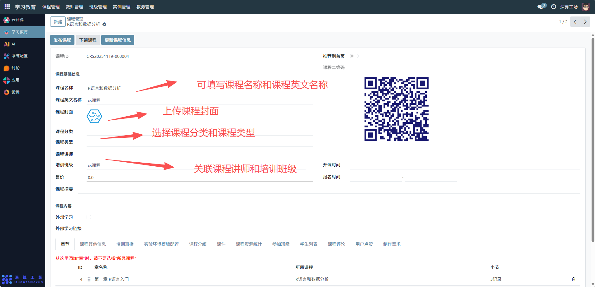

## 2、课程运营信息配置
- 售价：设置课程的价格（如 0.0 表示免费）。
- 开课时间 / 报名时间：配置课程的启动时间与报名窗口期。
- 推荐到首页：开启后课程会展示在平台首页，提升曝光度。
- 发布课程 / 下架课程：点击按钮切换课程的可访问状态（发布后学生可查看，下架后不可访问）。

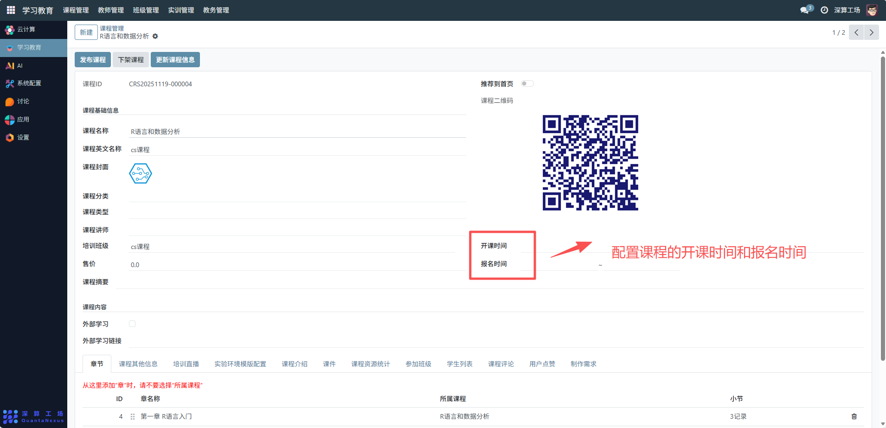
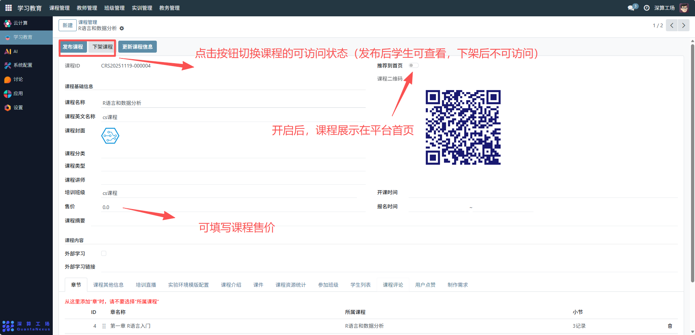

## 3、课程内容与资源配置
章节：点击 “添加行” 创建课程的章节（如 “第一章 R 语言入门”），并关联小节内容，搭建课程知识结构。

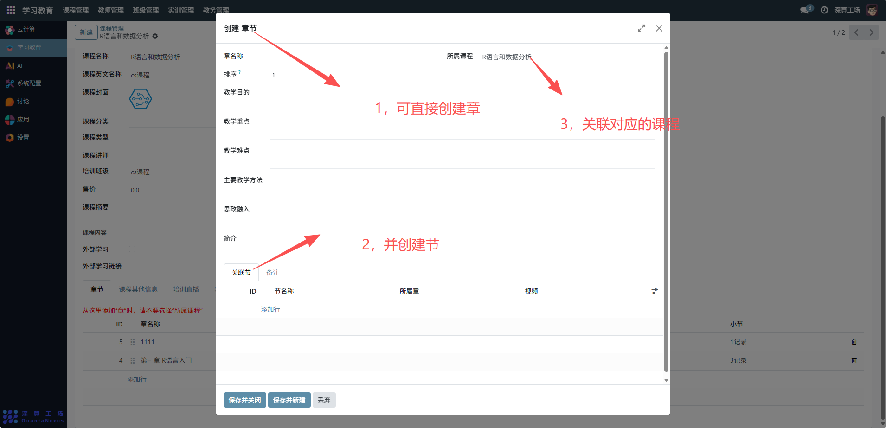
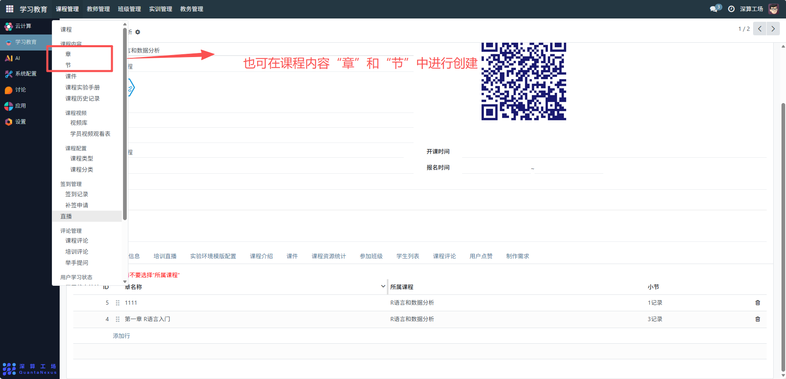
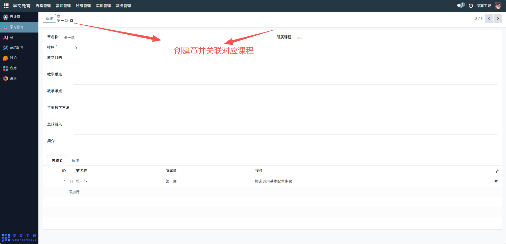
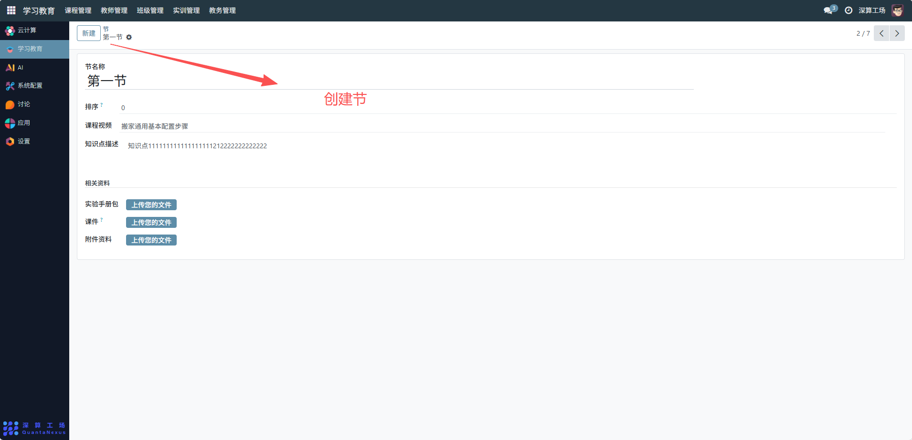

课程内容 / 课程摘要：填写课程的详细介绍与简介，帮助学生了解课程。

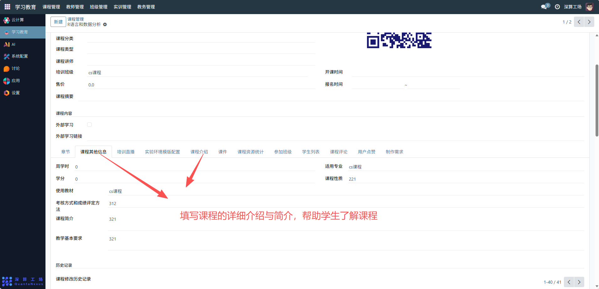

外部学习链接：关联外部学习资源（如参考资料链接）。

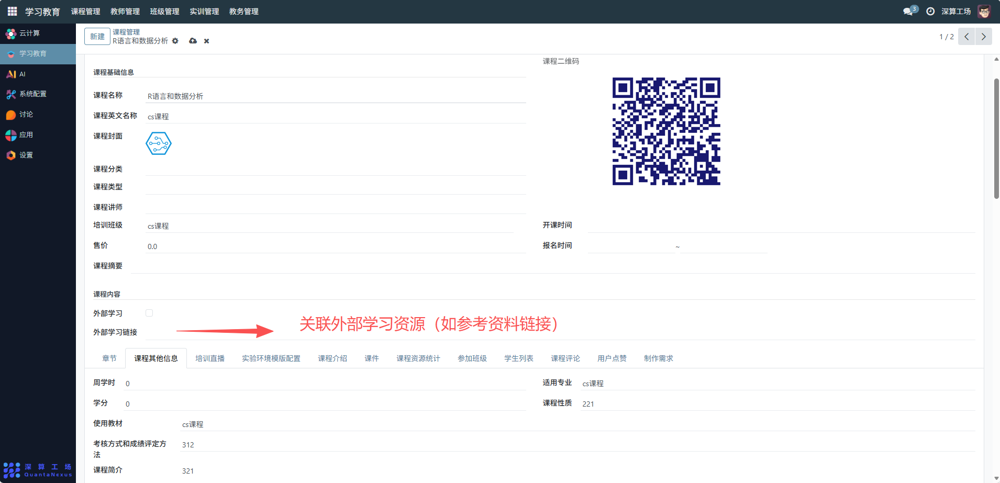

实验环境模板配置 ：关联课程所需的实验环境模板。

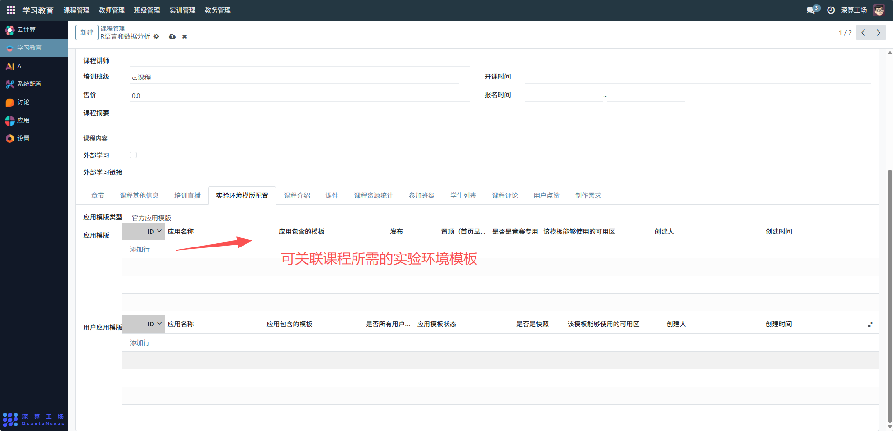

课件:关联教学课件资源

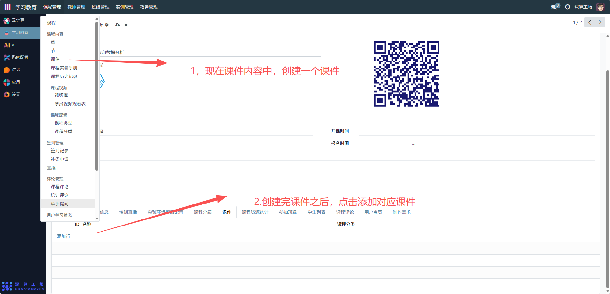

## 4、课程互动与数据管理
学生列表：查看选修该课程的学生信息。
课程评论 / 用户点赞：管理学生的评论与点赞互动内容。
课程资源统计：查看课程资源的使用数据（如课件下载量）。

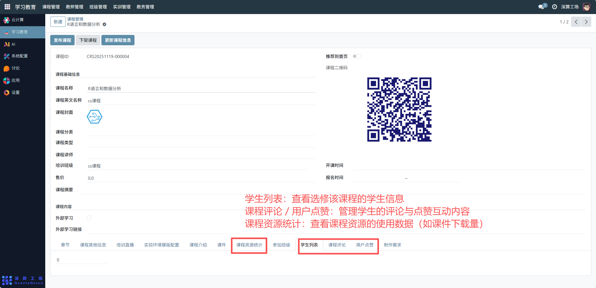
