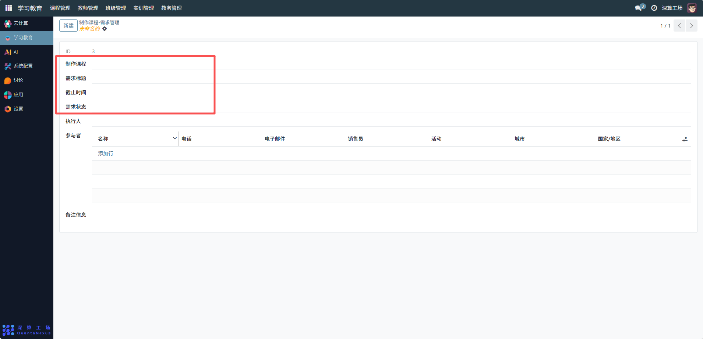
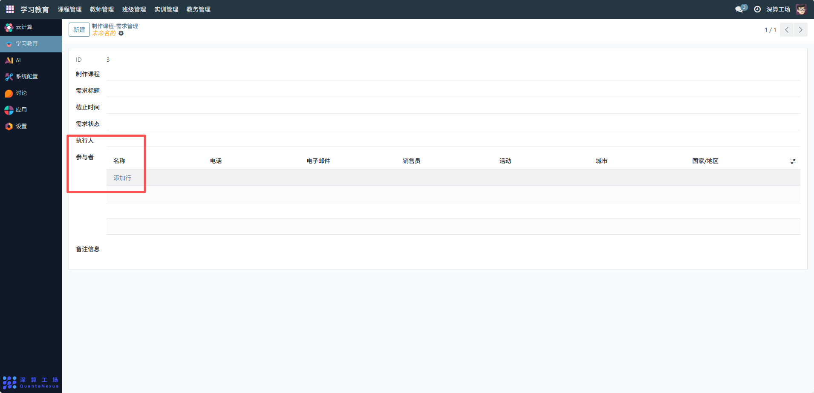
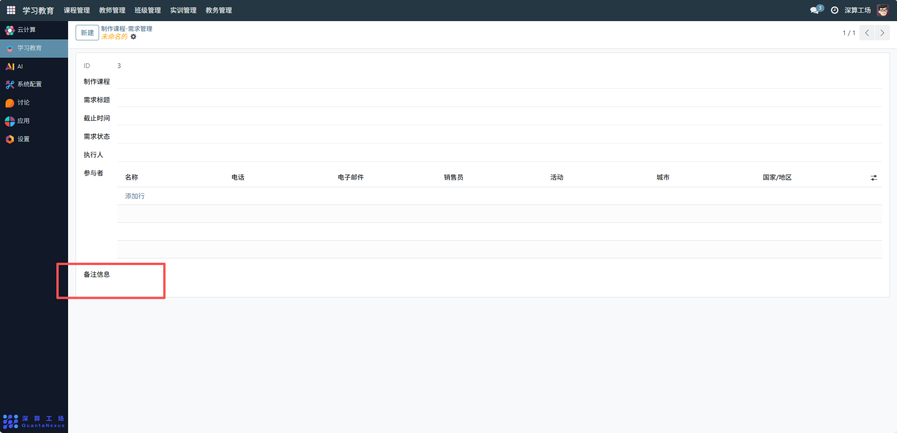

# 需求管理
“制作课程 - 需求管理” 是课程开发环节的需求统筹工具，核心作用是集中管理课程制作的需求信息（如需求内容、时间节点、责任人），明确课程开发的目标与分工，实现课程从需求提出到落地的全流程管控，是保障课程高效开发的核心协调模块。
## 1、需求基础信息配置
- 制作课程：关联对应的课程（明确需求是为哪门课提出）；
- 需求标题：填写需求的核心主题（如 “补充 R 语言数据分析的实操案例”）；
- 截止时间：设置需求的完成时间节点，管控开发进度；
- 需求状态：选择需求的当前阶段（如 “待分配”“开发中”“已完成”）。

## 2、人员分工配置
- 执行人：选择课程制作的负责人；
- 参与者：点击 “添加行”，填写协作人员的名称、电话、电子邮箱等信息，明确协作团队。

## 3、补充信息配置
备注信息：填写需求的补充说明（如具体的案例要求、参考资料），辅助开发人员理解需求。

