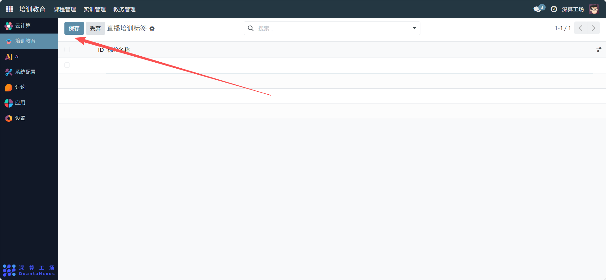

# 直播培训标签
“直播培训标签” 是直播培训内容的分类标识工具，核心作用是给不同直播培训设置统一的标签（如 “数据分析”“Python 基础”），实现直播培训的结构化分类与快速检索，是提升直播培训管理与查找效率的辅助模块。
## 1、核心用途
- 直播培训的分类标准化：通过 “标签名称” 定义直播培训的分类维度（如 “职场技能”“技术进阶”），统一直播的分类规则；
- 直播培训的快速检索：给直播关联对应的标签后，可通过标签筛选同类直播（如筛选所有 “数据分析” 标签的直播）；
- 直播体系的结构化管理：借助标签梳理直播培训的内容体系，让直播资源的归类更清晰。
## 2、标签基础信息配置
ID：系统自动生成的标签唯一标识（无需手动填写）；
标签名称：填写标签的分类名称（如 “机器学习实战”“Excel 进阶”），需清晰区分不同直播类型。

