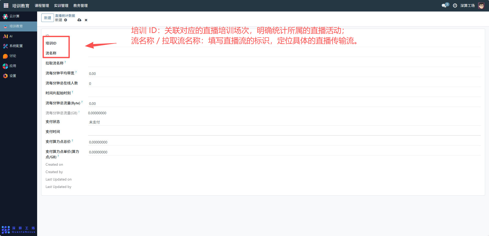
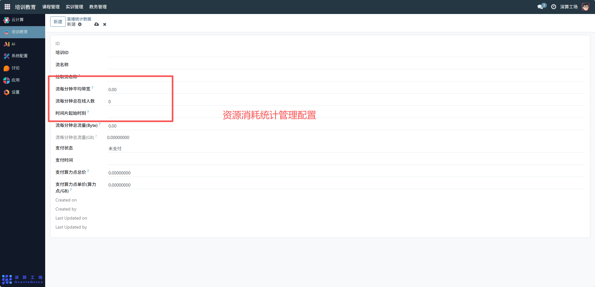
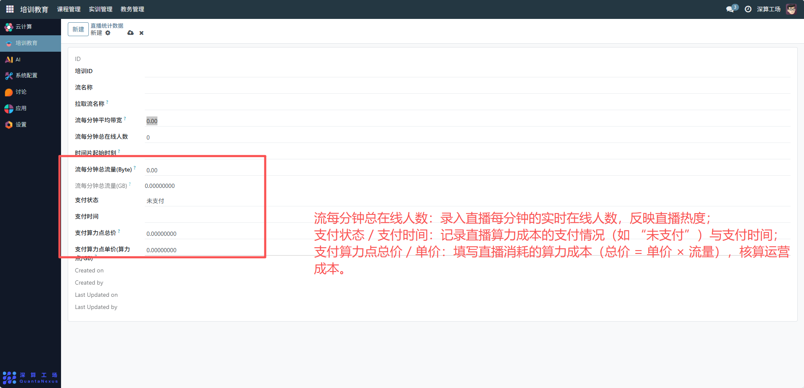
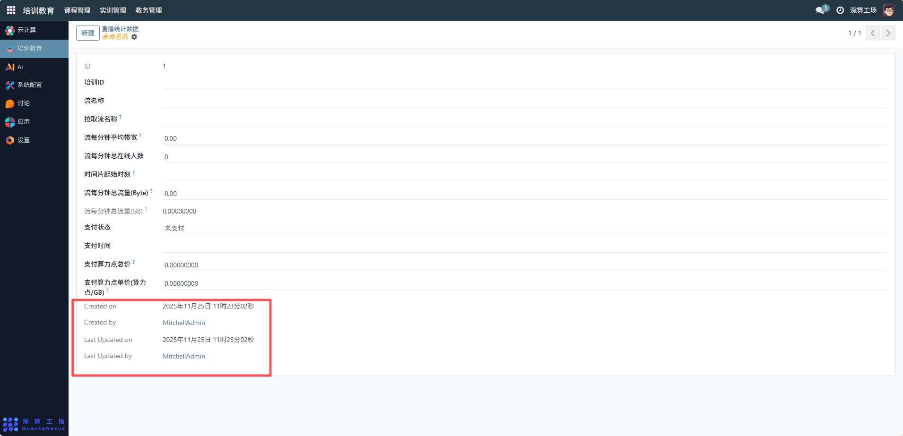

# 直播统计数据
“直播统计数据” 是培训直播场景中的资源消耗与运营数据汇总工具，核心作用是记录直播的流量、在线人数、算力成本等关键数据，实现直播资源消耗的监控、运营成本的核算与直播效果的量化评估，是支撑直播运维与成本管理的核心数据模块。
## 1、基础关联配置
- 培训 ID：关联对应的直播培训场次，明确统计所属的直播活动；
- 流名称 / 拉取流名称：填写直播流的标识，定位具体的直播传输流。

## 2、资源消耗统计配置
- 流每分钟平均带宽：自动或手动录入直播每分钟的平均网络带宽（单位通常为 Mbps）；
- 流每分钟总流量（Byte/GB）：统计直播每分钟的流量消耗，支持 Byte、GB 两种单位；
- 时间片起始时刻：填写数据统计的时间起点，明确统计的时间范围。

## 3、运营与成本配置
- 流每分钟总在线人数：录入直播每分钟的实时在线人数，反映直播热度；
- 支付状态 / 支付时间：记录直播算力成本的支付情况（如 “未支付”）与支付时间；
- 支付算力点总价 / 单价：填写直播消耗的算力成本（总价 = 单价 × 流量），核算运营成本。

## 4、审计信息
Created on/by、Last Updated on/by：记录数据的创建、更新信息，实现数据追溯。

