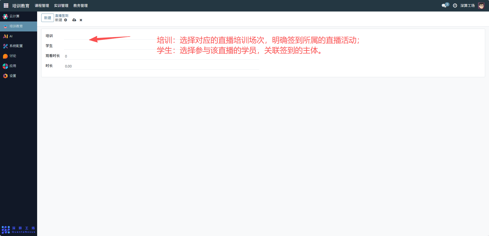
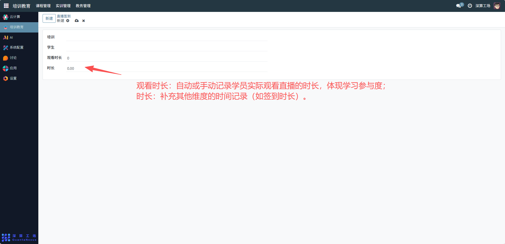

# 直播签到
“直播签到” 是培训直播场景中的学员出勤管理工具，核心作用是记录学员参与直播培训的签到信息与观看时长，实现直播培训的出勤统计与学习时长跟踪，是保障直播培训参与度、统计学习数据的核心模块。
## 1、直播与学员关联配置
- 培训：选择对应的直播培训场次，明确签到所属的直播活动。
- 学生：选择参与该直播的学员，关联签到的主体。

## 2、时长数据记录
- 观看时长：自动或手动记录学员实际观看直播的时长，体现学习参与度；
- 时长：补充其他维度的时间记录（如签到时长）。

