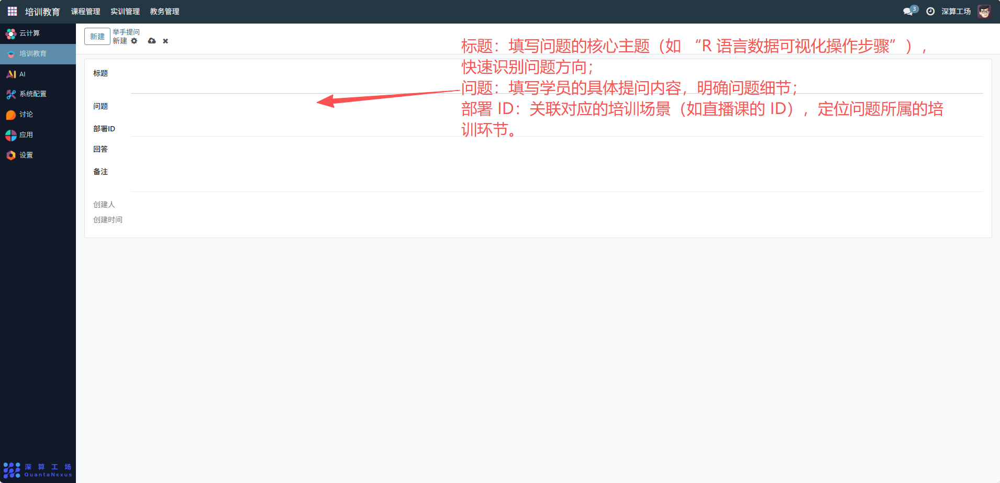
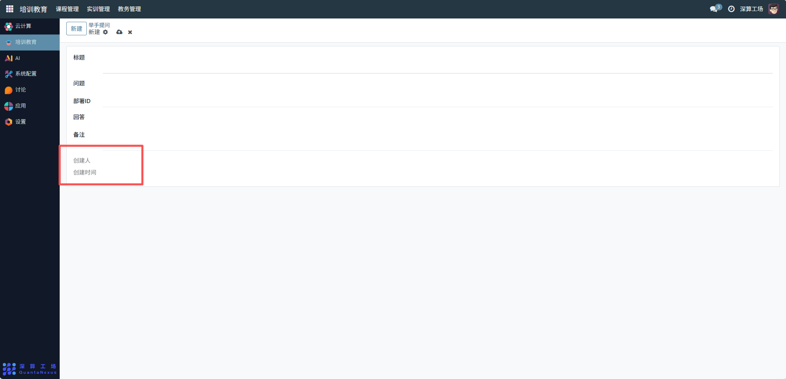

# 举手提问
“举手提问” 是培训教育场景中（如直播课）的实时互动工具，核心作用是记录学员在培训过程中提出的问题、关联对应的培训内容，并跟踪问题的回答情况，实现培训过程中 “提问 - 回答” 的闭环管理，是提升培训互动性与答疑效率的核心模块。
## 1、问题基础信息配置
- 标题：可查看问题的核心主题（如 “R 语言数据可视化操作步骤”），快速识别问题方向；
- 问题：可查看学员的具体提问内容，明确问题细节；
- 部署 ID：关联对应的培训场景（如直播课的 ID），定位问题所属的培训环节。

## 2、问答闭环配置
- 回答：可查看问题的解答内容，完成答疑；
- 备注：可查看补充问题的额外说明（如 “该问题后续会在实训中重点讲解”）。

## 3、审计信息
创建人 / 创建时间：记录提问学员与提问时间，实现问题的追溯。

