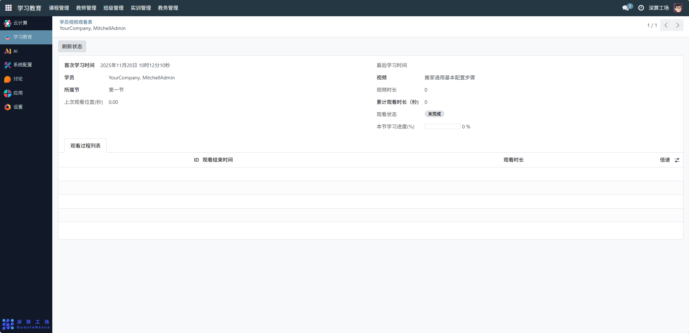

# 学员视频观看表
“学员视频观看表” 是学习教育平台中追踪学员视频学习行为的统计工具，核心作用是记录单个学员对特定课程视频的学习数据（如观看时长、进度、状态），实现对学员学习过程的精准监控与学习效果的评估，是辅助教学管理与学习跟踪的核心数据工具。
## 1、核心用途
- 学习行为全追踪：记录学员的首次 / 最后学习时间、上次观看位置、累计观看时长等，还原学习过程；
- 学习进度可视化：通过 “观看状态”“本节学习进度 (%)” 直观展示学员的学习完成情况；
- 学习数据精细化统计：通过 “观看过程列表” 记录每次观看的时长、倍速等细节，深入分析学习习惯；
- 教学管理辅助：依据这些数据评估学员的学习参与度，为教学调整提供依据。

