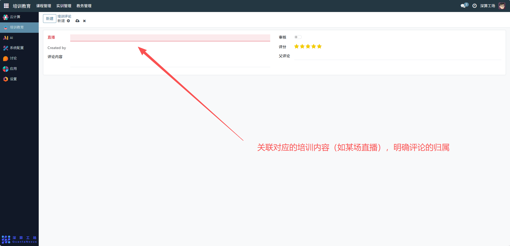
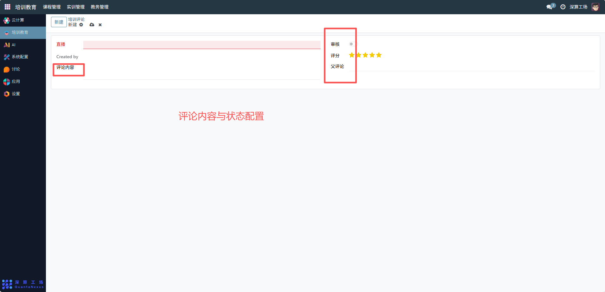

# 培训评论
“培训评论” 是培训教育平台中直播等培训内容的互动反馈工具，核心作用是收集学员对培训内容（如直播）的评分与评论，通过审核机制管控内容展示，实现培训口碑的收集、筛选与互动，是连接学员反馈与培训优化的核心互动模块。
## 1、评论基础关联配置
- 直播：关联对应的培训内容（如某场直播），明确评论的归属；
- Created by：记录评论发布者，定位反馈来源。

## 2、评论内容与状态配置
- 审核：勾选后评论对外展示，未勾选则仅后台可见，实现内容管控；
- 评分：展示学员对培训的星级评价（如 5 星），直观体现满意度；
- 评论内容：填写学员的文字反馈，记录具体体验；
- 父评论：可关联上级评论，实现评论的层级互动（如回复评论）。

