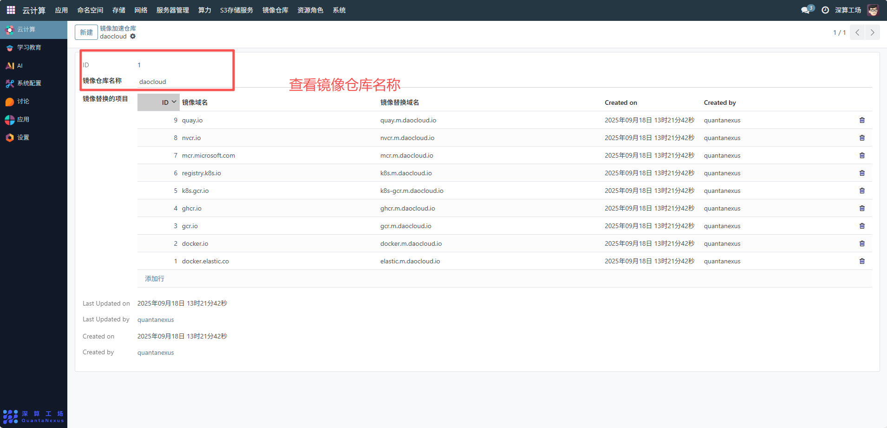
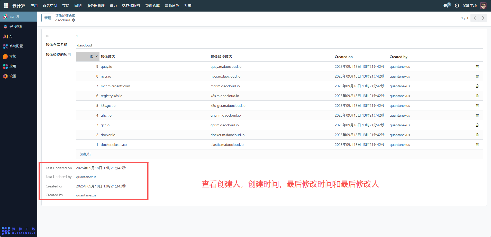

# 镜像加速仓库
镜像加速仓库是用于提升容器镜像拉取速度的 “镜像代理 / 替换工具”，核心作用是将外部公共镜像仓库的镜像地址替换为国内加速域名（如 daocloud 的镜像加速地址），同时统一管理加速规则。
## 1、加速仓库基础配置
ID：系统自动生成的加速仓库唯一标识；
镜像仓库名称：可查看编辑加速仓库的标识，区分不同的加速服务提供商（如 daocloud、阿里云等）。

## 2、镜像替换规则配置
点击 “添加行”，配置外部镜像源与加速域名的替换关系：
- 镜像域名：可查看需要加速的外部公共镜像源地址。
- 镜像替换域名：可查看填写对应的国内加速域名，实现 “拉取外部镜像时自动替换为加速地址”。

## 3、审计与更新记录
- Created on/Created by：自动记录每条替换规则的创建时间与创建人，明确规则的归属；
- Last Updated on/Last Updated by：记录加速仓库的最后修改时间与修改人，便于追溯配置变更。

