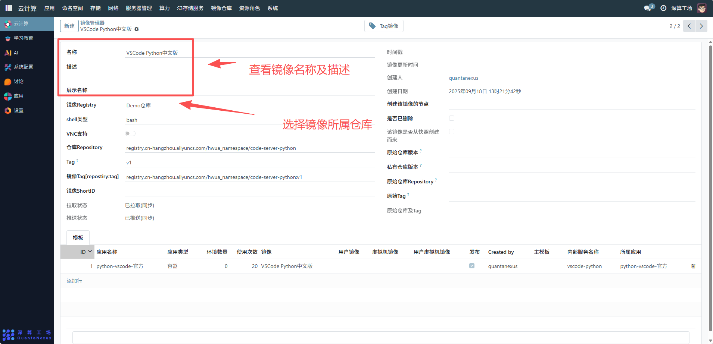
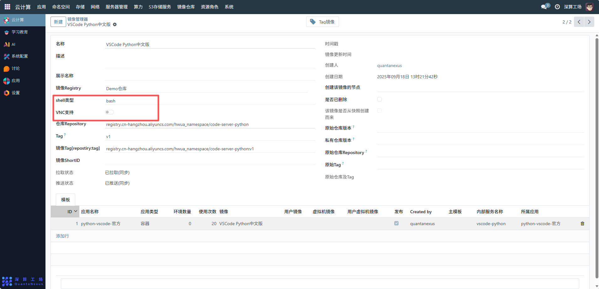
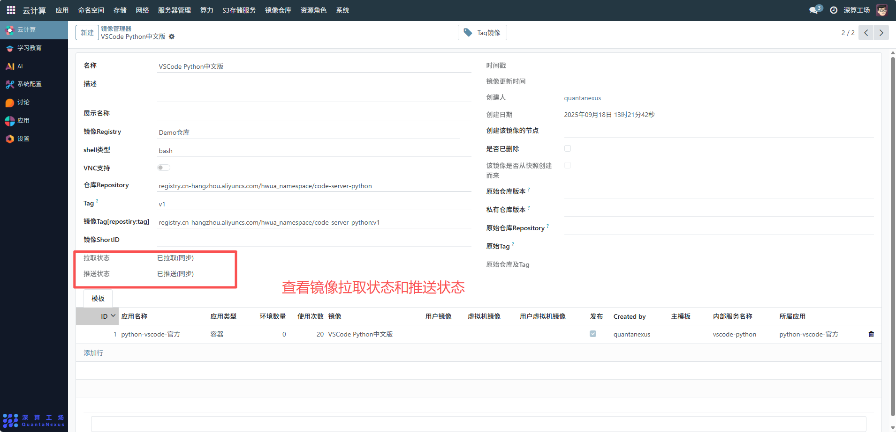
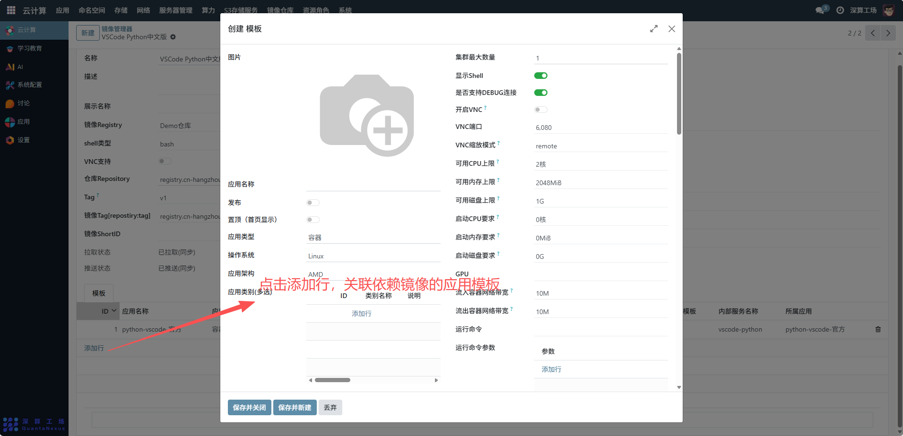
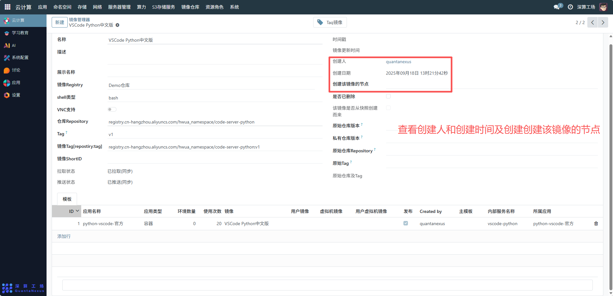

# 公共容器镜像
“公共容器镜像管理器” 是容器镜像的全生命周期管理工具，核心作用是集中管理公共镜像的信息、状态与关联应用，实现镜像从 “存储→配置→使用” 的统一管控，是容器化应用部署的镜像资源中枢。
## 1、镜像基础信息配置
- 名称 / 展示名称 / 描述：填写镜像的标识（如 “VSCode Python 中文版”）、展示用名称及功能描述，便于快速识别镜像用途；
- 镜像 Registry：选择该镜像所属的仓库（如 “Demo 仓库”），关联镜像的存储位置；
- 仓库 Repository/Tag：填写镜像在仓库中的路径）与版本 Tag（如 “v1”），精准定位镜像；
- 镜像 Tag [repository:tag]：系统自动拼接的镜像完整地址（Repository+Tag），是应用拉取镜像的唯一标识。

## 2、镜像运行与功能配置
- shell 类型：指定镜像启动后默认的 Shell 类型（如 “bash”），匹配应用的操作环境；
- VNC 支持：开启后，镜像支持 VNC 远程桌面连接（适用于图形化应用）。

## 3、镜像状态与关联管理
- 拉取状态 / 推送状态：展示镜像是否已从仓库拉取、是否推送到目标仓库，确认镜像的流通状态；
- 模板（表格）：点击 “添加行”，关联依赖该镜像的应用模板（如 “python-vscode - 官方”），明确镜像的使用场景；
- 是否已删除 / 该镜像是否从快照创建而来：标记镜像的生命周期状态，管控镜像的可用性。

## 4、审计信息
- 创建人 / 创建日期：记录镜像的创建主体与时间，明确镜像的归属；
- 创建该镜像的节点：记录镜像最初创建的集群节点，便于追溯镜像的来源

