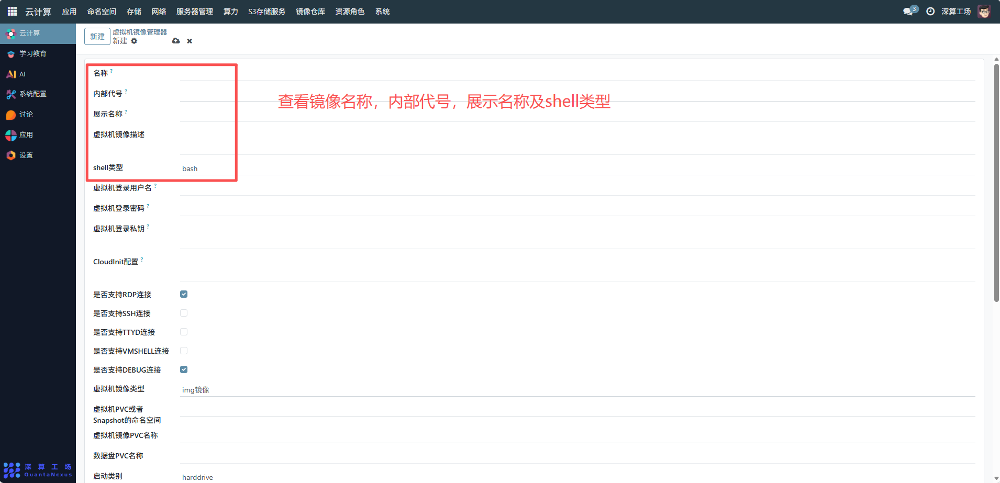
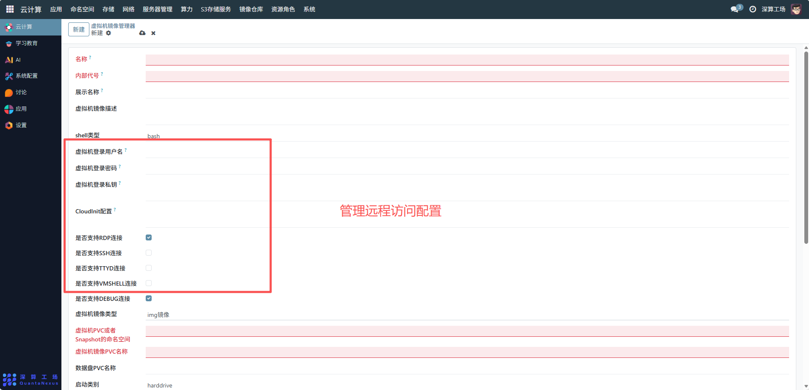
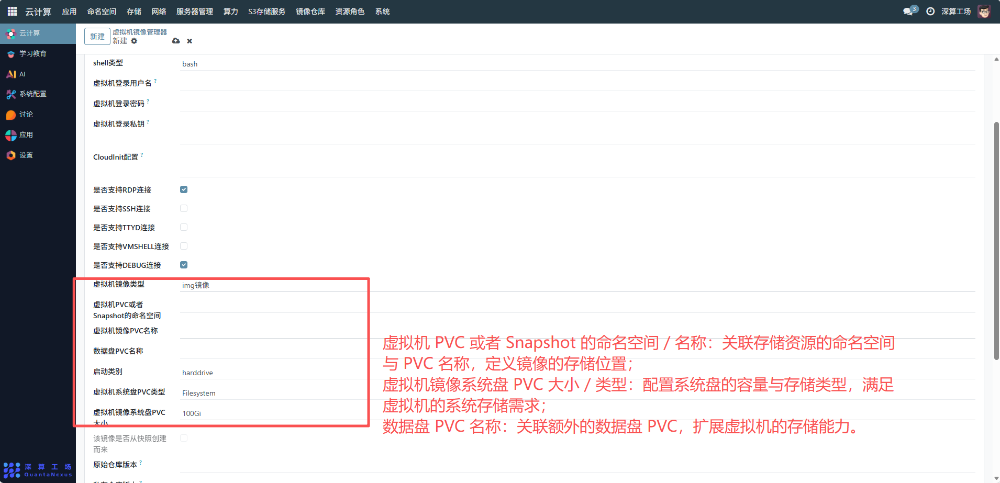
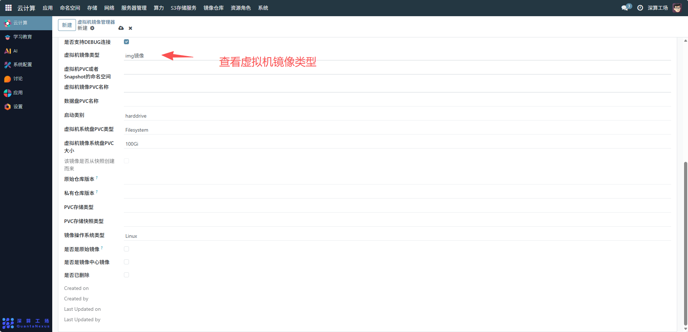
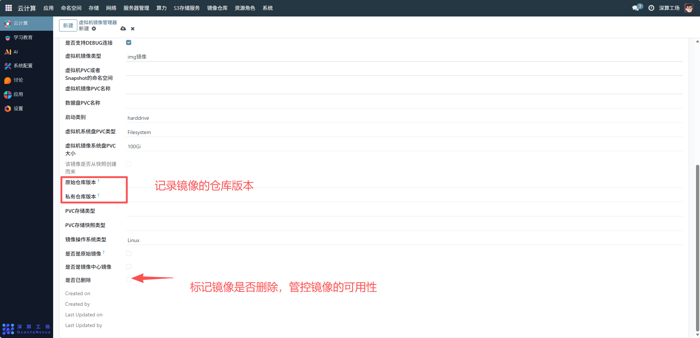
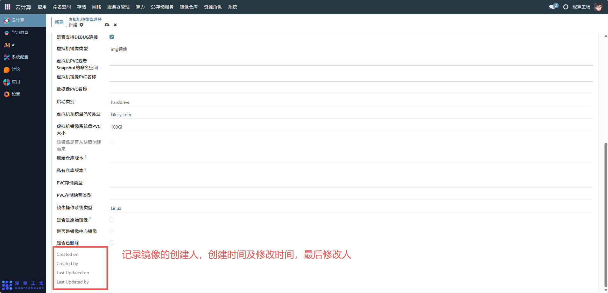

# 公共虚拟机镜像
虚拟机镜像管理器是虚拟机镜像的全生命周期管理工具，核心作用是集中配置、管控虚拟机运行所需的镜像（包含系统、应用环境），支撑虚拟机的快速创建、启动与运维，是虚拟化环境中虚拟机部署的核心资源中枢。
## 1、镜像基础标识配置
- 名称 / 内部代号 / 展示名称：填写镜像的标识（如 “CentOS7 开发镜像”），区分不同镜像；“虚拟机镜像描述” 补充镜像的用途（如 “用于后端服务开发的 CentOS7 镜像”）。
- shell 类型：指定镜像默认的 Shell 环境，匹配虚拟机的操作需求。

## 2、登录与远程访问配置
- 虚拟机登录用户名 / 密码 / 私钥：配置虚拟机的登录凭证，支持密码或密钥登录；
- 是否支持 RDP/SSH/TTYD 等连接：勾选对应的远程连接方式（如 RDP 用于 Windows 图形化访问、SSH 用于 Linux 命令行访问），开启虚拟机的远程运维能力。

## 3、存储与系统配置
- 虚拟机 PVC 或者 Snapshot 的命名空间 / 名称：关联存储资源的命名空间与 PVC 名称，定义镜像的存储位置。
- 虚拟机镜像系统盘 PVC 大小 / 类型：配置系统盘的容量（如 100Gi）与存储类型（如 Filesystem），满足虚拟机的系统存储需求。
- 数据盘 PVC 名称：关联额外的数据盘 PVC，扩展虚拟机的存储能力。

## 4、镜像状态与版本配置
- 虚拟机镜像类型：填写镜像格式（如 img 镜像）。
- 该镜像是否从快照创建而来：标记镜像的来源（快照创建则可追溯原始镜像）。
- 原始仓库版本 / 私有仓库版本：记录镜像的仓库版本，便于版本追溯。
- 是否已删除：标记镜像是否废弃，管控镜像的可用性。

## 5、审计信息
Created on/Created by/Last Updated on/Last Updated by：记录镜像的创建、修改时间与主体，实现配置变更的可追溯。

