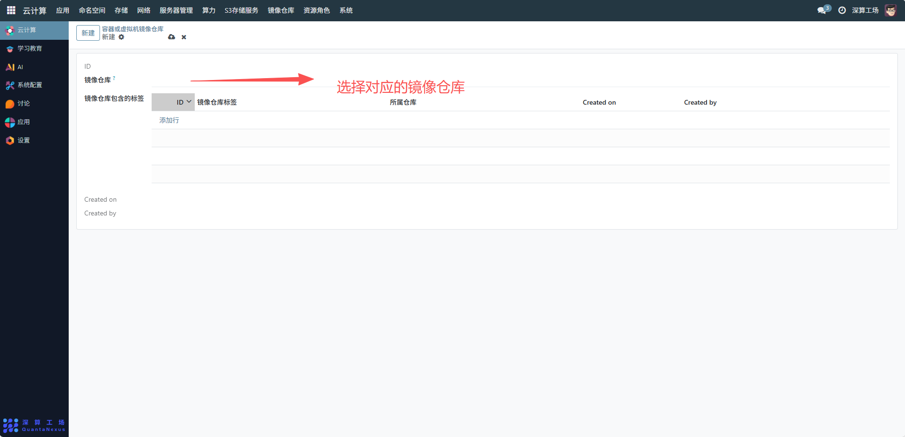
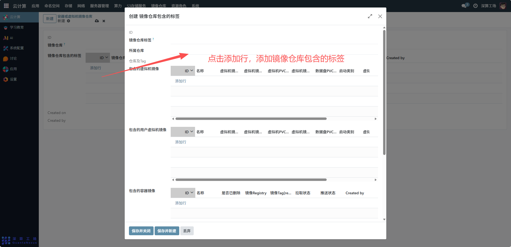

# 仓库地址
“容器或虚拟机镜像仓库” 是统一管理容器镜像与虚拟机镜像的集中存储库，核心作用是将容器镜像（支撑容器化应用）和虚拟机镜像（支撑虚拟化环境）整合到同一仓库中，实现两类镜像的集中存储、标签分类与生命周期管控，是容器与虚拟化环境共用的镜像资源中枢。
## 1、仓库基础关联配置
镜像仓库：选择已创建的镜像仓库实例（如之前配置的 “Demo 仓库”），作为两类镜像的存储载体；

## 2、镜像标签分类配置
- 镜像仓库包含的标签（表格）：点击 “添加行”，为仓库内的镜像配置标签：
- 镜像仓库标签：填写标签名称（如 “容器镜像”“虚拟机镜像”“开发环境”）；
- 所属仓库：自动关联当前仓库，明确标签的归属；

## 3、审计信息
Created on/Created by：记录仓库配置的创建时间与主体，实现配置变更的可追溯。

