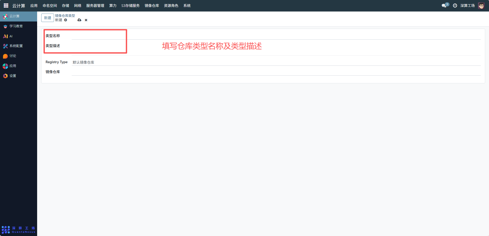
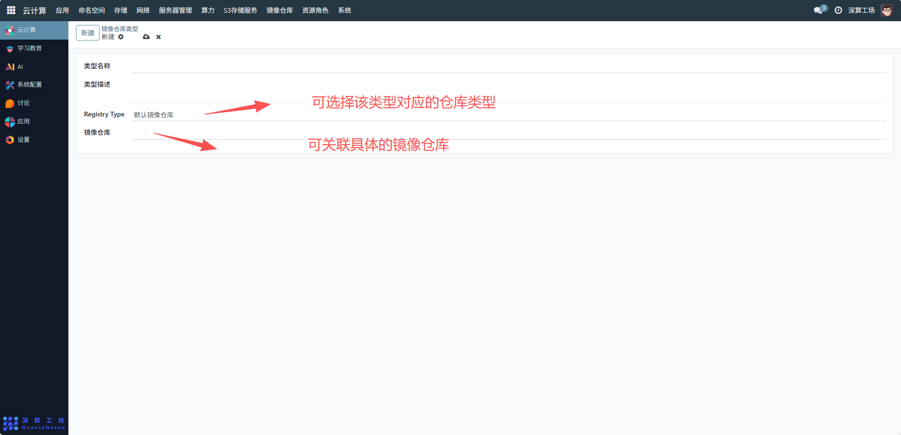

# 镜像仓库类型
“镜像仓库类型” 是镜像仓库的分类模板工具，核心作用是标准化不同镜像仓库的类型标识（如 “默认镜像仓库”“私有镜像仓库”），为后续创建具体的镜像仓库实例提供统一的分类框架，便于镜像仓库的批量管理与类型区分。
## 1、类型基础信息配置
- 类型名称：填写仓库类型的标识（如 “默认镜像仓库”“阿里云私有仓库”），需清晰区分不同类型；
- 类型描述：补充该类型仓库的说明（如 “默认公共镜像仓库，用于存储平台共享镜像”），明确类型的用途。

## 2、仓库类型关联配置
- Registry Type：选择该类型对应的仓库类型，关联底层的仓库服务类型。
- 镜像仓库：后续可关联具体的镜像仓库实例（创建仓库时选择该类型）。

