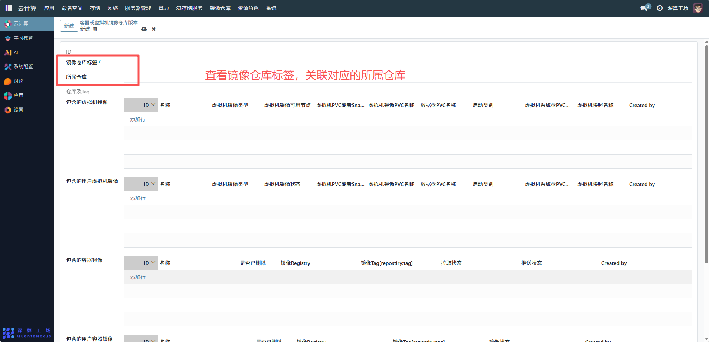
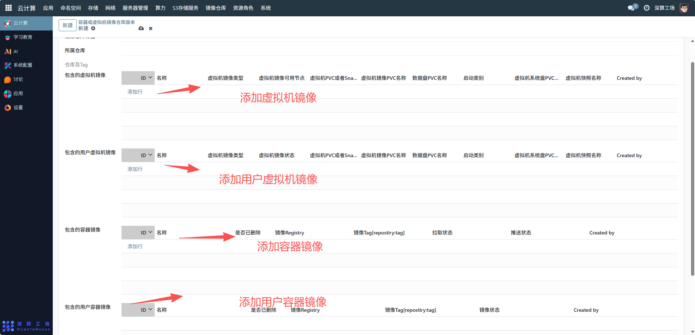
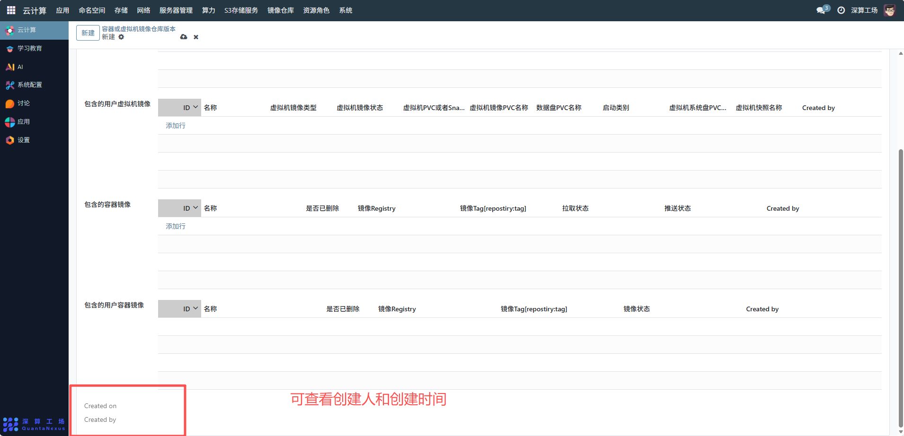

# 容器或虚拟机镜像仓库版本
“容器或虚拟机镜像仓库版本” 是镜像仓库的版本化管理工具，核心作用是对仓库中各类镜像（公共虚拟机镜像、用户虚拟机镜像、容器镜像、用户容器镜像）进行版本打包与统一管控，实现镜像组合的版本化发布、追溯与复用，支撑应用 / 虚拟机部署的版本一致性。
## 1、版本基础关联配置
镜像仓库标签 / 所属仓库 / 仓库及 Tag：关联对应的镜像仓库与标签，明确该版本所属的仓库范围；

## 2、镜像清单配置
- 点击各镜像分类下的 “添加行”，选择需纳入当前版本的镜像：
- 包含的虚拟机镜像：选择公共虚拟机镜像，配置其类型、可用节点、存储卷等信息。
- 包含的用户虚拟机镜像：选择用户自定义的虚拟机镜像，关联其状态、存储配置；
- 包含的容器镜像：选择公共容器镜像，确认其拉取 / 推送状态；
- 包含的用户容器镜像：选择用户自定义的容器镜像，记录其版本 Tag 与状态。

## 3、审计信息
Created on/Created by：记录版本的创建时间与主体，实现版本的可追溯。

