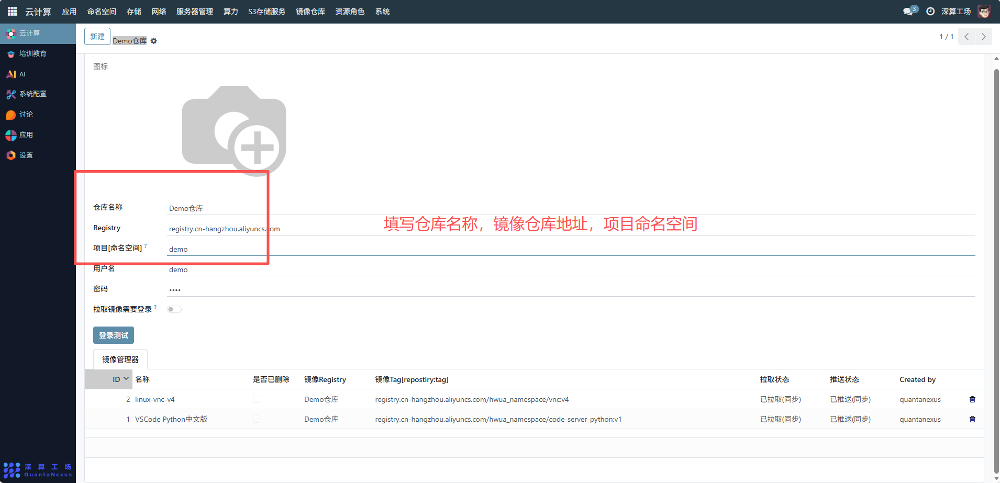
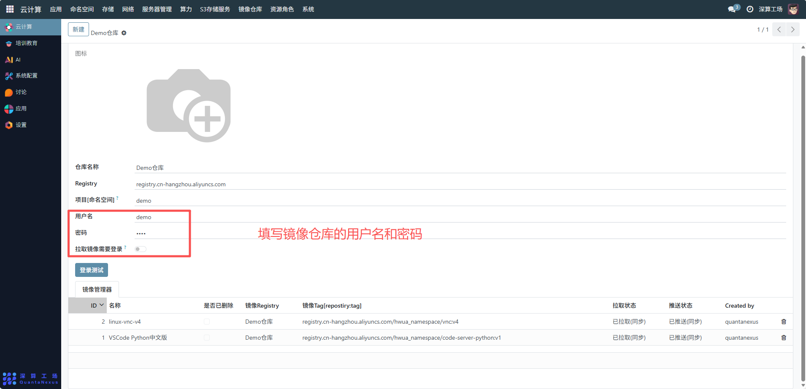
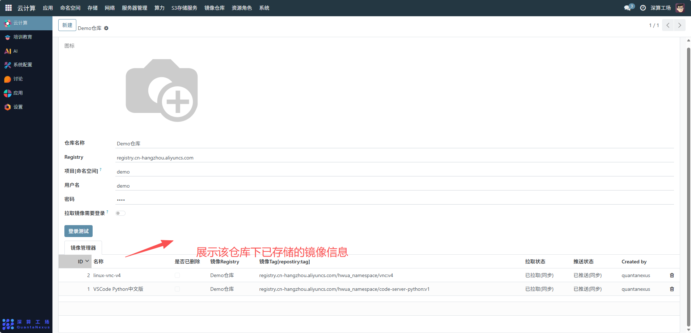

# 镜像仓库
“Demo 仓库” 核心作用是集中存储、管理应用的容器镜像，是应用部署时拉取镜像的 “资源库”，保障容器化应用能快速获取运行所需的镜像文件。
## 1、仓库基础信息配置
- 仓库名称：填写镜像仓库的标识（如 “Demo 仓库”），用于区分不同的镜像仓库实例；
- Registry：填写镜像仓库的地址，这是镜像上传 / 拉取的网络地址。
- 项目（命名空间）：填写仓库对应的命名空间（如 “demo”），用于隔离不同项目 / 团队的镜像（避免镜像重名）。

## 2、仓库权限配置
- 用户名 / 密码：填写镜像仓库的访问账号与密码，用于认证（确保只有授权用户能上传 / 拉取镜像）；
- 拉取镜像需要登录：开启后，拉取该仓库的镜像必须先登录账号，提升镜像的访问安全性。

## 3、镜像管理操作
登录测试：配置完成后，点击 “登录测试” 验证用户名 / 密码是否能成功连接到 Registry 地址；
镜像管理器（表格）：展示该仓库下已存储的镜像信息，包含镜像名称、Registry 地址、Tag（版本）、拉取 / 推送状态等，可对镜像进行删除、版本管理等操作。

