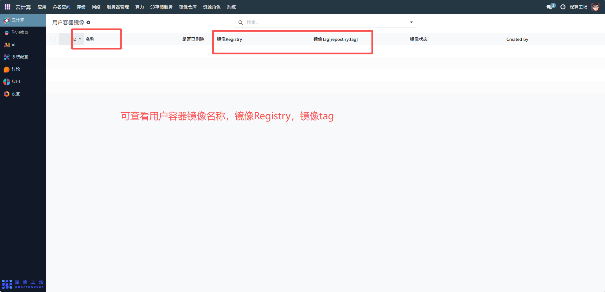
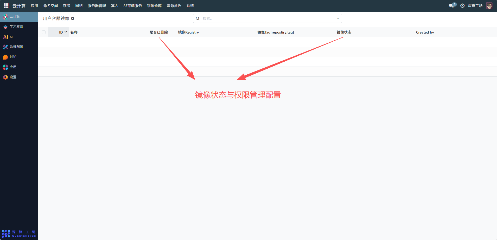
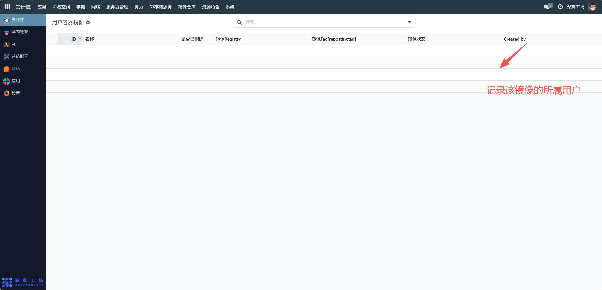

# 用户容器镜像
“用户容器镜像” 是面向单个用户的容器镜像专属管理模块，核心作用是隔离公共镜像与个人自定义的容器镜像，实现用户级别的镜像存储、状态追踪与权限管控，是个性化容器应用部署的资源支撑。
## 1、镜像基础信息配置（新增 / 编辑时）
- 名称：填写用户自定义的镜像标识（如 “个人 Python 开发镜像”）；
- 镜像 Registry：选择该镜像所属的仓库（通常关联用户有权限的私有 / 个人仓库）；
- 镜像 Tag [repository:tag]：填写镜像在仓库中的完整地址（含版本 Tag），精准定位用户镜像。

## 2、镜像状态与权限管理
- 是否已删除：标记镜像是否废弃，用户可自主管控镜像的可用性；
- 镜像状态：系统自动同步镜像的拉取 / 推送状态（如 “已同步”“待推送”），辅助用户确认镜像的流通情况。

## 3、审计信息
Created by：记录镜像的创建用户，明确用户镜像的归属；

