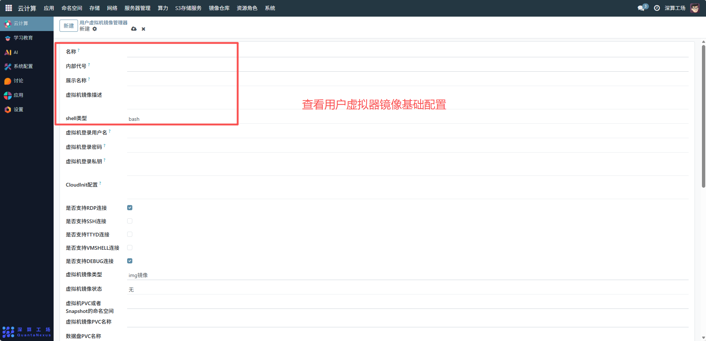
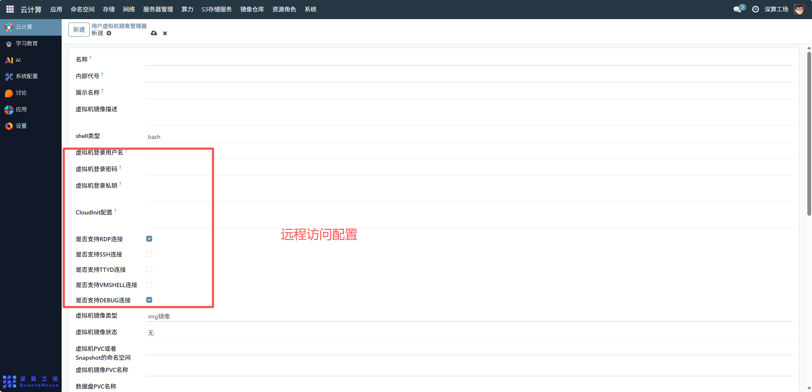
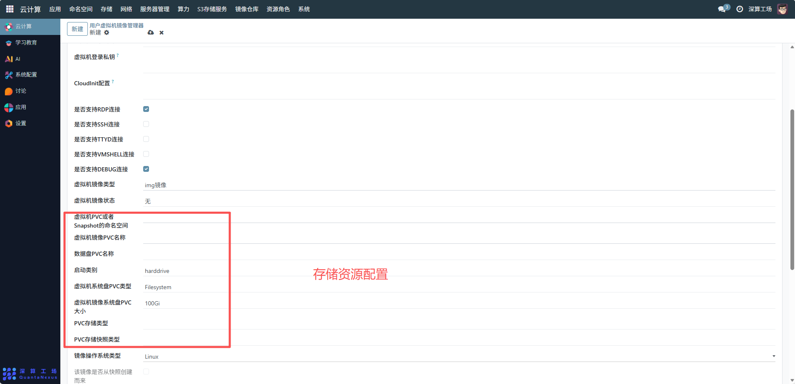
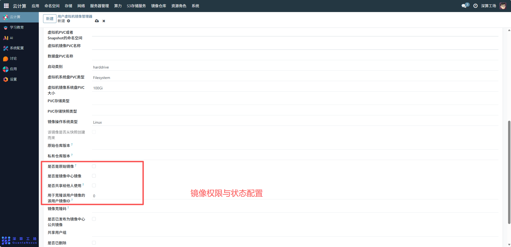
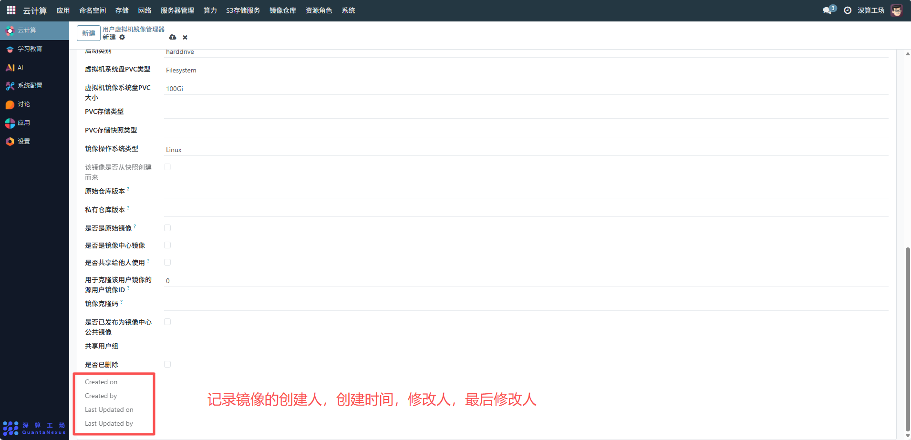

# 用户虚拟机镜像
“用户虚拟机镜像管理器” 是面向单个用户专属虚拟机镜像管理工具，核心作用是让用户自主配置、管控个性化的虚拟机镜像（包含系统环境、登录凭证、存储资源等），支撑个人专属虚拟机的快速创建与运维，实现虚拟机镜像的用户级隔离与定制化管理。
## 1、镜像基础标识配置
- 名称 / 内部代号 / 展示名称：填写镜像的专属标识（如 “个人开发 CentOS 镜像”），区分用户自定义的不同镜像；“虚拟机镜像描述” 补充镜像的用途（如 “用于 Python 后端开发”）；
- shell 类型：选择镜像默认的 Shell 环境（如 bash），匹配个人操作习惯。

## 2、登录与远程访问配置
- 虚拟机登录用户名 / 密码 / 私钥：设置个人虚拟机的登录凭证，支持密码或密钥登录；
- 是否支持 RDP/SSH 等连接：勾选对应的远程连接方式（如开启 RDP 用于图形化访问），配置个人虚拟机的运维入口。

## 3、存储资源配置
- 虚拟机 PVC 或者 Snapshot 的命名空间 / 名称：关联用户有权限的存储命名空间与 PVC，定义镜像的存储位置；
- 虚拟机镜像系统盘 PVC 大小 / 类型：配置系统盘的容量（如 100Gi）与存储类型（如 Filesystem），满足系统运行的存储需求；
- 数据盘 PVC 名称：关联额外的数据盘 PVC，扩展个人虚拟机的存储能力；
- 启动类别：选择镜像的启动方式（如 harddrive 表示从硬盘启动）。

## 4、镜像权限与状态配置
- 是否共享给他人使用：勾选后可将个人镜像共享给指定用户组，实现团队内镜像复用；
- 是否已删除：标记镜像是否废弃，自主管控个人镜像的生命周期；
- 该镜像是否从快照创建而来：标记镜像的来源，便于追溯原始配置。

## 5、审计信息（自动生成）
Created on/Created by/Last Updated on/Last Updated by：记录镜像的创建、修改时间与用户，实现个人镜像配置的可追溯。

