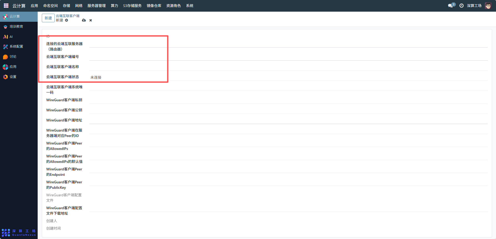
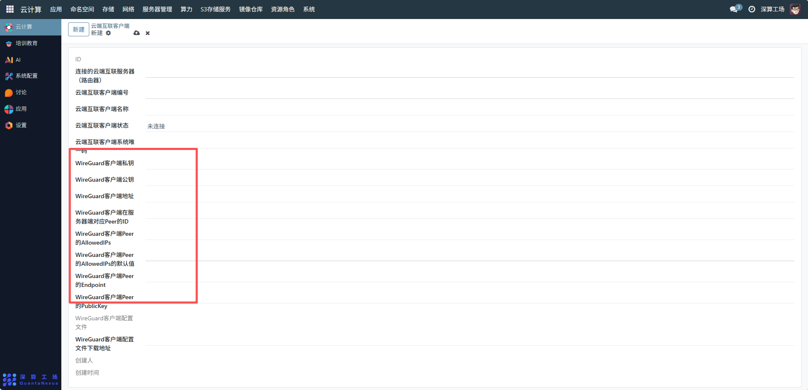
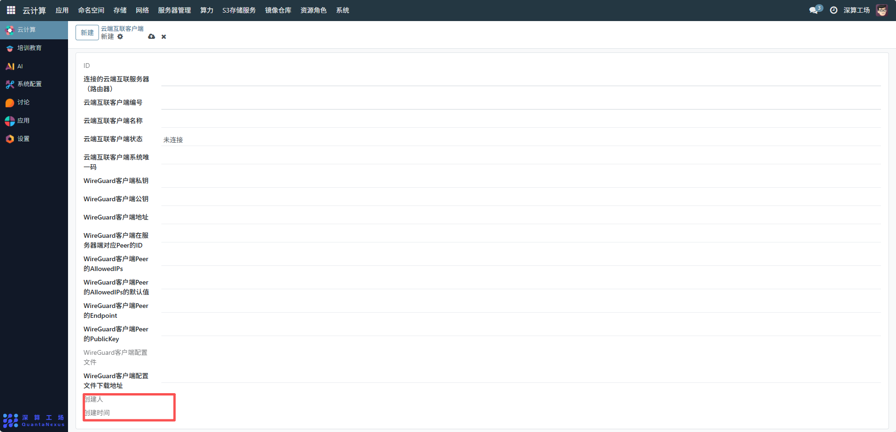

# 云端互联客户端
云端互联客户端是对接 “云端互联服务器” 的终端接入组件，核心作用是通过 WireGuard 加密协议与服务端建立安全隧道，让外部终端（如办公电脑、其他集群节点）能安全访问云端互联服务器所在的网络（如集群内部服务），是跨网络安全通信的 “终端入口”。
## 1、基础归属与标识配置
- 连接到的云端互联服务器：可查看选择对应的云端互联服务器，明确客户端要接入的隧道服务端；
- 云端互联客户端编号 / 名称：可查看客户端的唯一编号（如client-001）与名称（如 “办公电脑 A”），便于区分不同终端；
- 云端互联客户端系统唯一码：可查看自动生成的终端标识，用于绑定具体的设备（避免密钥被滥用）；
- 云端互联客户端状态：可查看部署后自动更新（如 “未连接→已连接”），用于监控终端的接入状态。

## 2、WireGuard 加密隧道配置
与服务端配合完成加密隧道的身份认证与网络配置：
- WireGuard 客户端私钥 / 公钥：
客户端的加密密钥对（可自动生成或手动填写）—— 私钥保存在客户端本地，公钥需提供给服务端（在服务端的 “客户端关联配置” 中填写），用于双向身份认证；
- WireGuard 客户端地址：
服务端分配给该客户端的隧道 IP（如10.30.0.2/24），需在服务端配置的隧道子网范围内；
- WireGuard 客户端在服务端对应的 Peer 的 ID：
关联服务端中该客户端的 Peer 配置 ID，确保客户端与服务端的 Peer 信息一一对应；
- WireGuard 客户端 Peer 的 AllowedIPs：
客户端可访问的网络范围（如10.20.0.0/16，即集群内部网络），需与服务端配置的 AllowedIPs 一致；
- WireGuard 客户端 Peer 的 Endpoint：
服务端的公网地址 + 端口（如203.0.113.10:51820），客户端通过该地址与服务端建立隧道连接；
- WireGuard 客户端 Peer 的 PublicKey：
服务端的公钥（需从云端互联服务器配置中获取），用于客户端验证服务端身份。

## 3、查看配置文件管理
WireGuard 客户端配置文件：系统自动生成的客户端配置文件（包含密钥、地址、Endpoint 等信息），可直接导入 WireGuard 客户端软件（如 Windows/macOS 的 WireGuard 应用）；
WireGuard 客户端配置文件下载地址：生成配置文件后的下载链接，方便终端用户获取配置。

## 4、创建人及创建时间的作用
创建人：查看关联当前配置操作的用户
创建时间：记录客户端的授权时间，便于审计（如 “某客户端是何时被授权接入的”），同时辅助清理长期未连接的闲置客户端。

