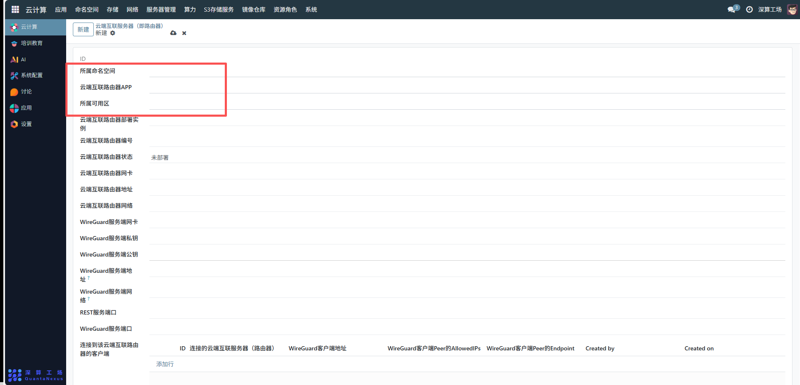
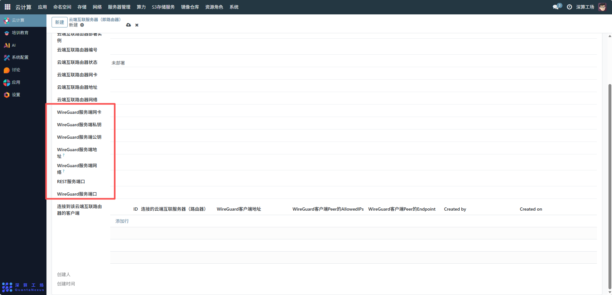
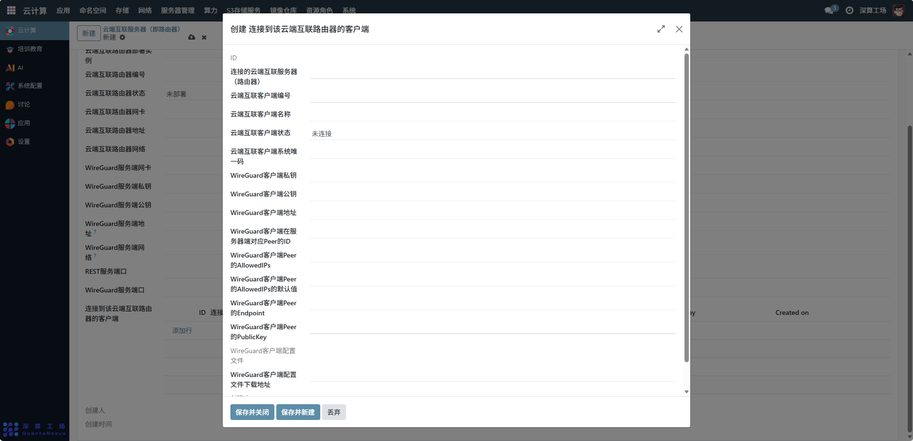
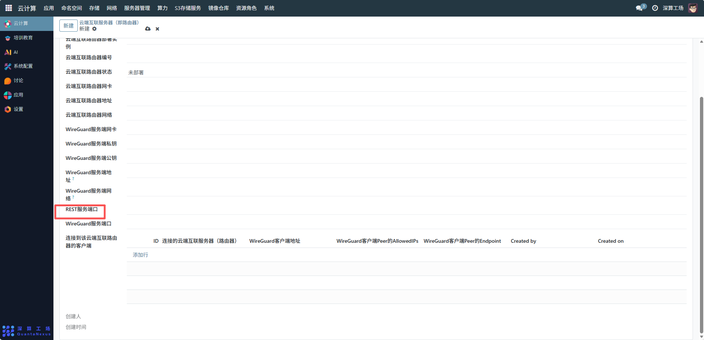
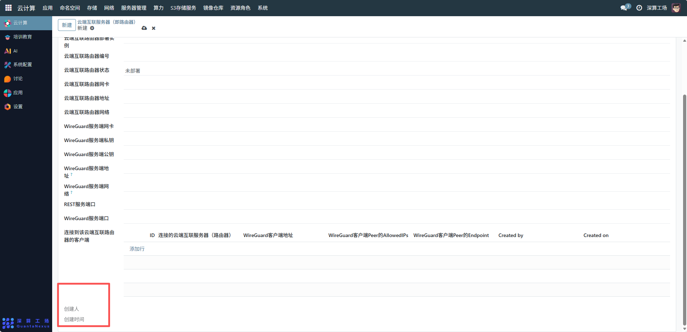

# 云端互联服务器
云端互联服务器是用于构建跨网络 / 跨环境安全互联通道的网络组件，核心作用是通过 WireGuard 等加密协议，实现集群内资源、云端服务、外部终端之间的安全通信（类似 “虚拟专用路由器”），同时支持网络地址转发、端口映射等功能。
## 1、基础归属配置
- 所属命名空间：可查看所属命名空间（如 “办公互联空间”），实现网络资源的隔离。
- 云端互联路由器 APP：关联对应的路由器应用模板（需提前配置，包含路由器的基础镜像、运行环境）。
- 所属可用区：选择路由器部署的可用区，确保与目标互联的网络在同一区域。

## 2、路由器实例配置
- 云端互联路由器部署实例：填写路由器的部署标识（如 “router-sh-01”），用于区分多台路由器。
- 云端互联路由器编号：系统自动生成的唯一编号，作为路由器的资源 ID。
- 云端互联路由器状态：部署后自动更新（如 “未部署→运行中”），用于监控路由器的运行状态。
- 云端互联路由器网卡 / 地址 / 网络：配置路由器的网络参数：
- 网卡：关联集群内的虚拟网卡。
- 地址：路由器在集群内的 IP 地址。
- 网络：关联对应的 IP 段，限定路由器的网络范围。

## 3、WireGuard 加密隧道配置
- WireGuard 是轻量级加密 VPN 协议，用于构建安全互联通道，需配置以下参数：
- WireGuard 服务端网卡：关联路由器的虚拟网卡，作为隧道的网络入口。
- WireGuard 服务端私钥 / 公钥：自动生成或手动填写的加密密钥对，用于服务端与客户端的身份认证（私钥保存在服务端，公钥提供给客户端）。
- WireGuard 服务端地址 / 网络：
- 地址：WireGuard 隧道的服务端 IP。
- 网络：隧道的子网范围，客户端需在该子网内分配 IP。
- WireGuard 服务端端口：隧道的通信端口（如 “51820”，WireGuard 默认端口）。

## 4、客户端关联配置
- 连接到该云端互联路由器的客户端（表格）：点击 “添加行”，配置允许接入隧道的客户端信息：
- WireGuard 客户端地址：分配给客户端的隧道 IP（如 “10.30.0.2/24”）。
- WireGuard 客户端 Peer 的 AllowedIPs：客户端可访问的网络范围（即集群内部网络）。
- WireGuard 客户端 Peer 的 Endpoint：客户端的公网地址，用于服务端与客户端建立连接。
- Created by/Created on：自动记录客户端配置的创建人、时间，用于审计追溯。

## 5、其他服务配置
REST 服务端口：可查看路由器提供的 REST API 端口（如 “8080”），用于通过 API 管理路由器状态。

## 6、创建人及创建时间
- 创建人：自动关联当前配置操作的用户，作为该路由器的管理员，拥有后续修改、删除、添加客户端的权限。
- 创建时间：记录路由器的部署起点，后续可结合状态变更时间，分析路由器的运行稳定性（如 “创建后 30 天内是否出现过中断”）。

