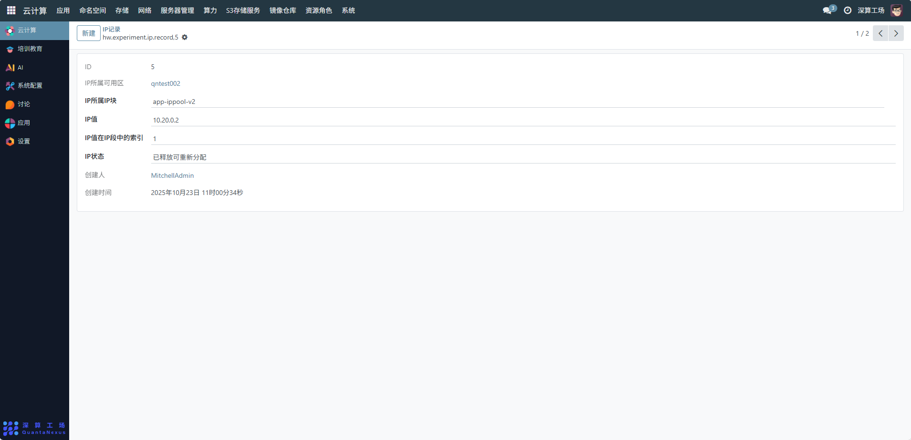

# IP记录
IP 记录是集群中单个 IP 地址的使用台账，核心作用是追踪 IP 地址的归属、状态与生命周期（分配 / 释放），实现 IP 地址的精细化管理，避免地址滥用或冲突。
## 1、信息查看与状态管理
查看 IP 详情：通过 ID、IP 值等信息，查询单个 IP 的归属、状态、创建信息，了解其生命周期。
手动调整 IP 状态：若需强制回收 / 预留 IP，可手动修改 “IP 状态”（如将 “已分配” 改为 “已释放”），但需确保对应的资源已停止使用。

