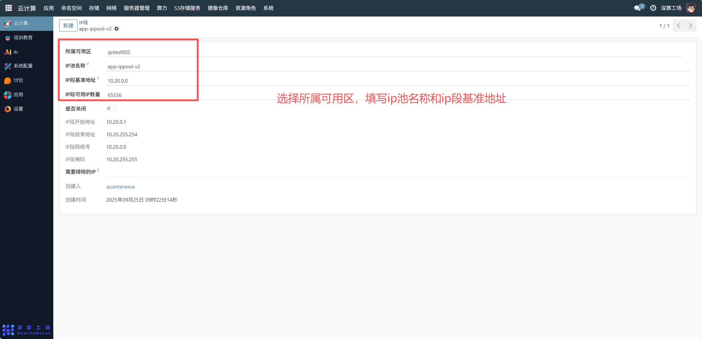
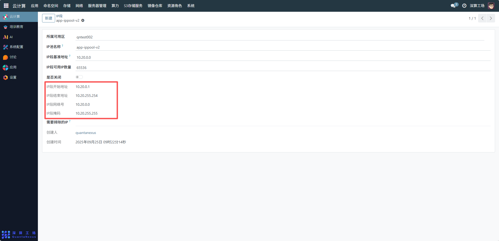
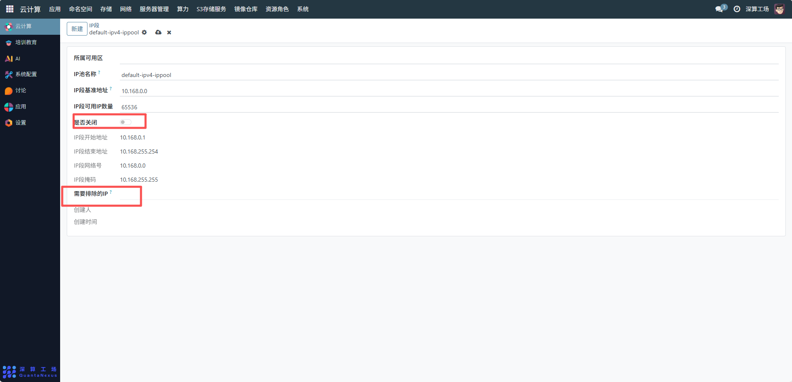

# IP段
IP 段是集群中用于分配网络 IP 地址的地址范围集合，核心作用是为集群内的应用、容器、节点等资源提供可管理的 IP 地址，实现网络地址的统一规划、分配与隔离，保障集群网络的有序运行。
## 1、基础信息配置
- 所属可用区：选择 IP 段对应的可用区，关联 IP 段的物理 / 逻辑部署区域。
- IP 池名称：填写 IP 池的标识名称，便于区分不同业务的 IP 池；
- IIP 段基准地址 / 可用数量：
- I基准地址：定义 IP 段的网络地址；
- I可用数量：对应 IP 段的地址总数。

## 2、IP 段范围配置
- IIP 段开始 / 结束地址：明确 IP 池的地址区间，限定可分配的 IP 范围；
- IIP 段网络号 / 掩码：配置 IP 段的网络参数，确保 IP 地址在同一子网内。

## 3、高级配置
- I是否关闭：关闭开关后，该 IP 池将停止分配新 IP，但已分配的 IP 仍可使用；
- I需要排除的 IP：填写需预留 / 排除的 IP 地址（如网关、DNS 服务器 IP），避免这些 IP 被自动分配。

