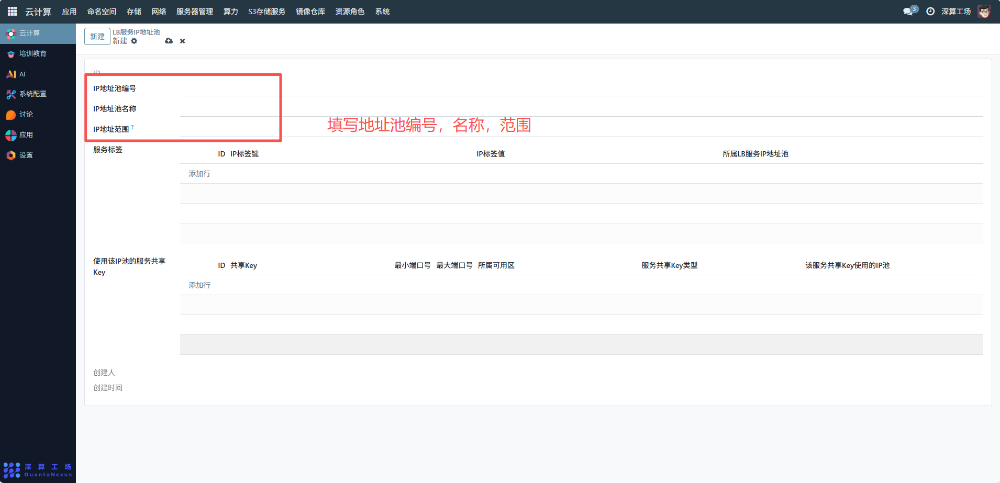
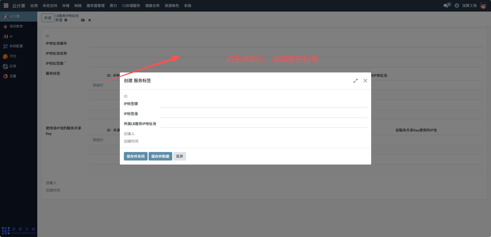
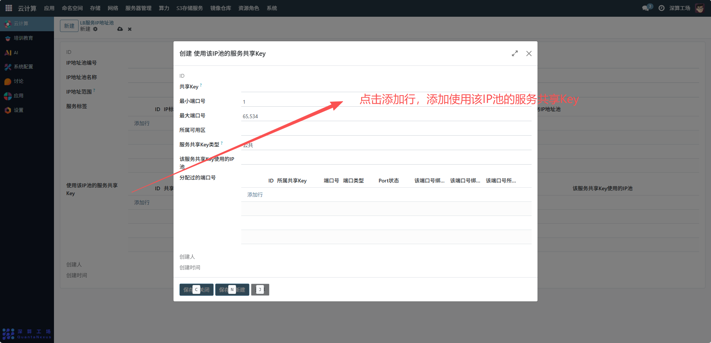

# LB服务地址池
LB 服务 IP 地址池是为负载均衡（LB）服务分配公网 / 集群内访问 IP 的专属地址池，核心作用是统一管理 LB 服务的入口 IP，确保 LB 服务能稳定对外提供访问端点，同时实现 LBIP 的有序分配与隔离。
## 1、基础信息配置
- IP 地址池编号 / 名称：填写池的唯一编号与标识名称（如 “电商业务 LB-IP 池”），区分不同业务的 LBIP 池；
- IP 地址范围：配置 LB 服务可用的 IP 区间（如192.168.100.10-192.168.100.20），限定 LB 服务可分配的 IP 范围。

## 2、服务标签配置
点击 “服务标签” 下的 “添加行”，关联 LBIP 池与服务的标签规则：
- IP 标签键 / 值：配置标签（如service-type: e-commerce），实现 “特定标签的服务优先使用该 LBIP 池” 的调度逻辑；
- 所属 LB 服务 IP 地址池：关联当前 IP 池，确保标签规则生效。

## 3、服务共享 Key 配置
点击 “使用该 IP 池的服务共享 Key” 下的 “添加行”，配置 LBIP 的端口与服务绑定规则：
共享 Key：填写服务的标识 Key，用于关联 LB 服务；
- 最小 / 最大端口号：限定该共享 Key 对应的端口范围（如80-8080），实现多服务通过同一 LBIP 的不同端口提供服务；
- 所属可用区 / 服务共享 Key 类型：关联可用区，并指定共享 Key 的业务类型（如 “HTTP 服务”）。

