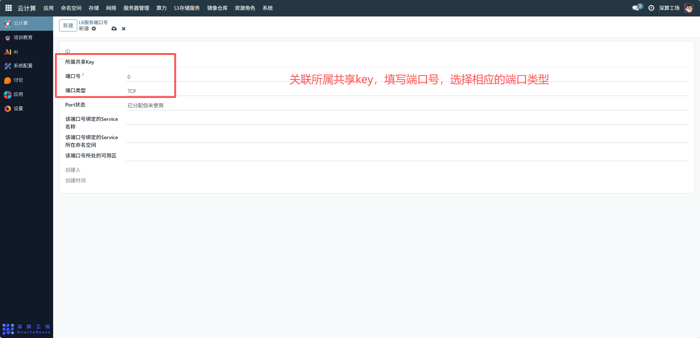
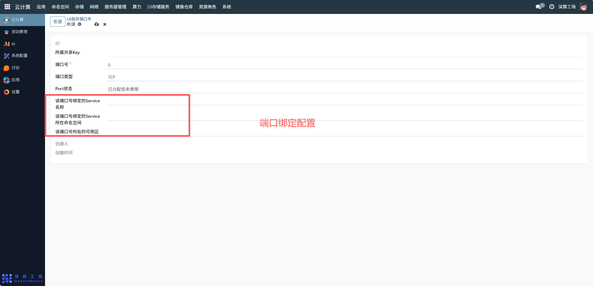

# LB服务端口号
LB 服务端口号是负载均衡（LB）服务对外提供访问的 “端口标识”，核心作用是为 LB 服务分配专属端口，实现多服务通过同一 LBIP 的不同端口对外提供访问，同时管理端口的状态与绑定关系，保障服务的网络连通性。
## 1、基础信息配置
- 所属共享 Key：关联对应的 LB 服务共享 Key（需提前在 “LB 服务 IP 地址池” 中配置），明确该端口所属的业务分组；
- 端口号：填写具体的端口数值（如 80、8080），需在 “LB 服务 IP 地址池” 配置的端口范围内；
- 端口类型：选择端口对应的网络协议（如 TCP、UDP，示例中为 TCP），匹配业务服务的通信协议。

## 2、端口绑定配置
- 该端口号绑定的 Service 名称 / 所在命名空间：关联对应的集群服务（Service），实现 “LB 端口 → Service → 后端容器” 的流量转发；
- 该端口号所处的可用区：关联端口对应的可用区，确保流量转发到对应区域的后端服务。

## 3、追溯与管理
- 创建人：指发起 “LB 服务端口号” 配置操作的用户账号（如管理员或用户）。
- 创建时间：记录该端口号配置被创建的具体时间。

