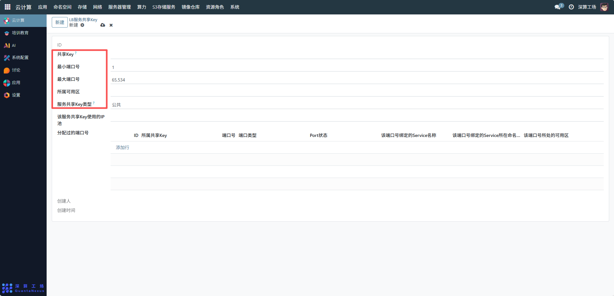

# LB服务共享Key
LB 服务共享 Key 是LB 服务端口与 IP 资源的 “分组管理标识”，核心作用是将一组 LB 端口、IP 池关联到同一业务分组，实现多服务的端口 / IP 资源统一管控，避免不同业务的资源混杂。
## 1、基础信息配置
- 共享 Key：填写分组标识（如 “public-service-key”），作为该资源组的唯一标识；
- 最小 / 最大端口号：定义该共享 Key 可使用的端口范围（如示例中 1-65534），限定端口的分配区间；
- 所属可用区：关联该资源组对应的可用区，确保资源与服务的区域一致性；
- 服务共享 Key 类型：选择类型（如 “公共”“私有”），限定资源组的使用权限（公共类型允许多业务使用，私有仅特定业务可用）。

## 2、关联资源配置
- 该服务共享 Key 使用的 IP 池：选择对应的 LB 服务 IP 地址池，将该共享 Key 的端口与指定 IP 池绑定，确保端口分配时使用该 IP 池的地址；
- 分配过的端口号：点击 “添加行”，关联已分配的端口信息（含端口号、类型、绑定的 Service 等），实现端口的全生命周期追踪。

