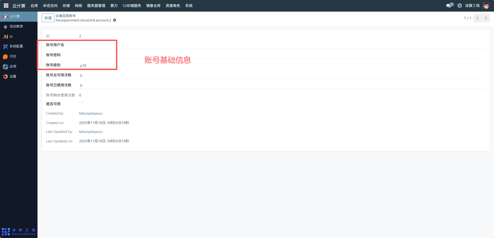
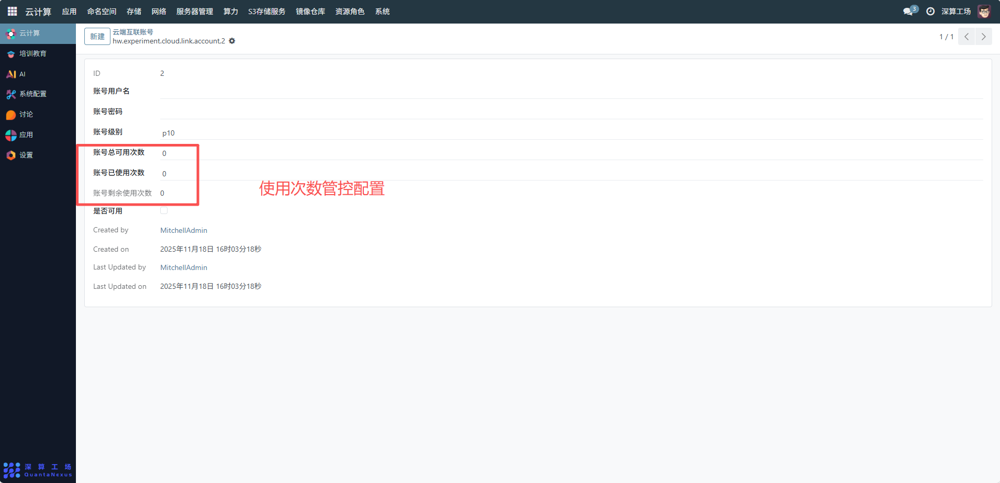
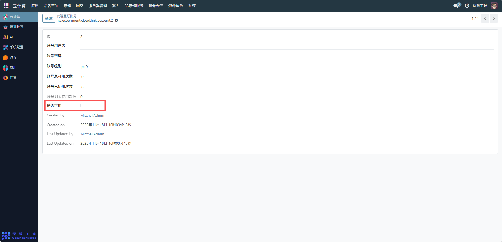
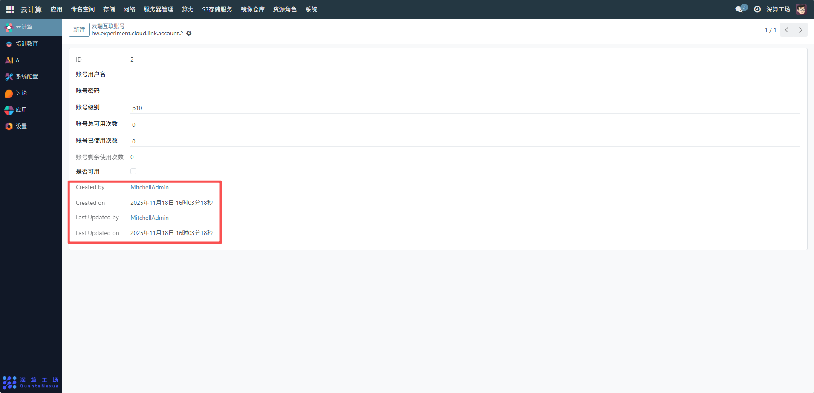

# 云端互联账号
云端互联账号是用于管控 “云端互联客户端” 接入权限的身份凭证，核心作用是为客户端接入云端互联服务器提供账号级的身份验证与使用次数限制，是终端安全接入的 “二次权限关卡”（与 WireGuard 密钥配合，实现双重安全管控）。
## 1、账号基础信息配置
- 账号用户名：可查看账号用户名
- 账号密码：可查看设置账号的访问密码（客户端接入时需输入），建议使用强密码（包含字母、数字、特殊字符）；
- 账号级别：可查看选择账号的权限等级（如p10），不同级别对应不同的网络访问范围。

## 2、使用次数管控配置
- 账号总可用次数：设置账号的最大使用次数（如10），适用于临时接入场景；若为长期账号，可设置为0（表示无次数限制）；
- 账号已使用次数：系统自动统计账号的使用次数，不可手动修改；
- 账号剩余使用次数：系统自动计算（总可用次数 - 已使用次数），当剩余次数为 0 时，账号自动失效。

## 3、账号状态配置
是否可用：勾选表示账号处于激活状态，客户端可使用该账号接入；取消勾选则账号被禁用，无法接入。

## 4、审计记录
- Created by/Created on：记录账号的创建人、创建时间，明确账号的归属与生成时间；
- Last Updated by/Last Updated on：记录账号的最后修改人、修改时间，用于审计账号的变更历史（如 “何时修改了账号级别”）。

